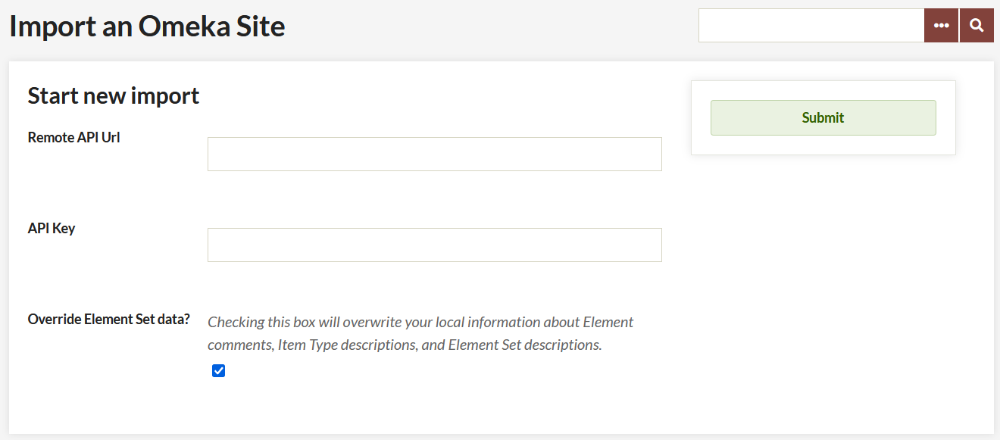

# Omeka API Import

The [Omeka API Import plugin](https://omeka.org/classic/plugins/OmekaApiImport/){target=_blank} allows users to import item data and users from an existing Omeka Classic installation (the "origin") via an API into their own Omeka Classic installation (the "target"). 

Multiple imports from the same origin site will update the data, not create new items.

## Requirements 

Omeka API Import requires Omeka Classic 2.0 or higher for the target site. The origin site must have Omeka Classic 2.1 or higher.

The origin Omeka Classic installation does not need to have the Omeka API Import plugin installed, but it does need to have [the API activated](../Admin/Settings/API_Settings.md). To do this, the owner of the origin Omeka Classic installation should go to the API tab under Settings, accessed via the top navigation bar on the administrative dashboard. Ensure that the “Enable API” box is checked.

To find the API url of the origin Omeka Classic installation, go to the home page of that installation. Add `/api` to the end of the url. You should see a page with the message "This is the endpoint URL for [name of origin site]" and links to the site information and available API resources. To confirm that the API is enabled, click on the link for available API resources; if you see `{"message":"API is disabled"}`, then you will not be able to import from this site.

## Installation 

You can download the latest version of Omeka API Import from the Omeka Classic Plugin Directory. To add the plugin to your Omeka site, follow the [plugin installation instructions](../Admin/Adding_and_Managing_Plugins.md) page.

## Importing 

### Without an API Key 

Without a key from the origin site, you can import all public items and collections, including their files.

1.  From the target Omeka Classic installation, where the plugin has been installed, go to the Omeka API Import tab on the left hand navigation of your administrator dashboard.
2.  Enter the API url of the origin Omeka installation (the base url with “/api” at the end, for example `http://originomeka.org/api`). You must include the http://. See the Requirements section above for more information on finding the correct API url. 
3.  Ignore the API Key field, since you are not using it.
4.  If you want to import annotations and changes to the element set on the target installation, check the Override Element set data checkbox. Note: this will overwrite all existing Element Set annotations and changes.
5.  Click Submit.

Depending on the size of the collection at the origin installation, it may take a few minutes for the import to complete.

### With an API Key 

If you have access to the admin side of the origin Omeka install, you can use one of the API keys assigned to a user to import users and private items and collections. See [API Settings](../Admin/Settings/API_Settings.md) for more information. NB: only those users who have created items will be imported.

To find an API key:

1.  Go to the Users link from the top navigation in the admin dashboard.
2.  Click on the Edit link below the name of the user whose key you wish to use. Note: Permissions for an API key follow the user’s account, so for best results, use a SuperUser or Admin user’s API key.
3.  Click on the API Keys link in the Edit User navigation. Copy the key.

To import using an API Key:

1.  From the target Omeka Classic installation, where the plugin has been installed, go to the Omeka API Import tab on the left hand navigation of your administrator dashboard.
2.  Enter the API url of the origin Omeka Classic installation (the base url with “/api” at the end, for example `http:// originomeka.org/api`). You must include the http://
3.  Enter the API Key you copied above into the API Key field.
4.  If you want to import annotations and changes to the element set on the target installation, check the Override Element set data checkbox. Note: this will overwrite all existing Element Set annotations and changes.
5.  Click Submit.

- Are your jobs starting and not completing? You might need to [set the path for PHP](../Technical/Setting_PHP_Path.md) so that your system can perform the background process to make the items.

## Undoing an Import

Once you have completed an import, there will be an option to Undo Imports on the Omeka API Import tab on the left navigation in the admin dashboard.

To undo an import, find the url of the import that you wish to undo, check the box next to the url, and click Submit.

## Known Plugin Conflicts

**[Collection Tree](CollectionTree.md)** (on the target site) and Omeka API Import create a conflict that makes the import fail. The workaround is to simply deactivate Collection Tree while you do the import, and reactivate it after the import succeeds.

## Compatible Plugins

If [Geolocation](Geolocation.md) (v2.2.1 or higher) or [ExhibitBuilder](ExhibitBuilder.md) (v3.1.1 or higher) plugins are installed and active on both sites, data from those plugins will be imported.

Deactivate the plugin on either site to prevent the data from being imported.
