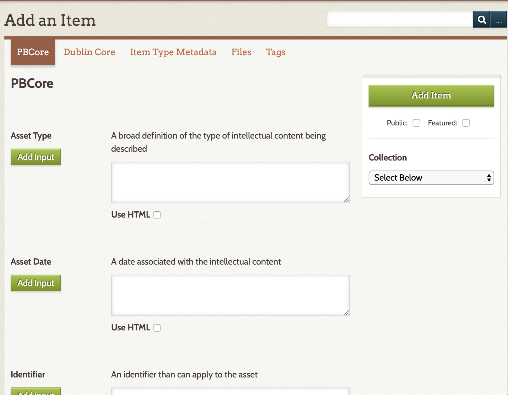
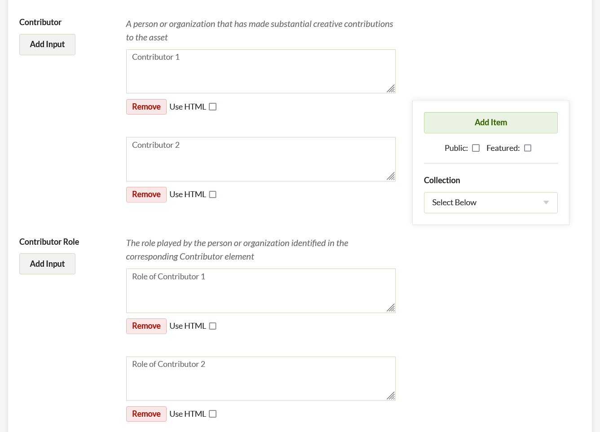
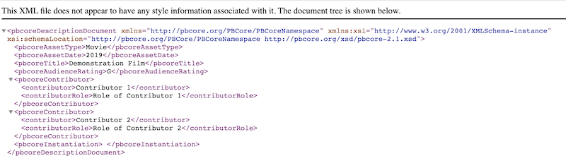
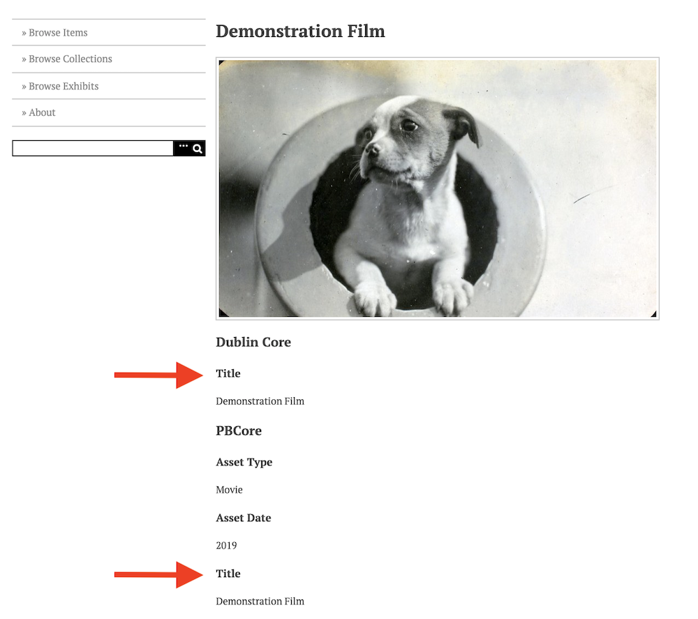
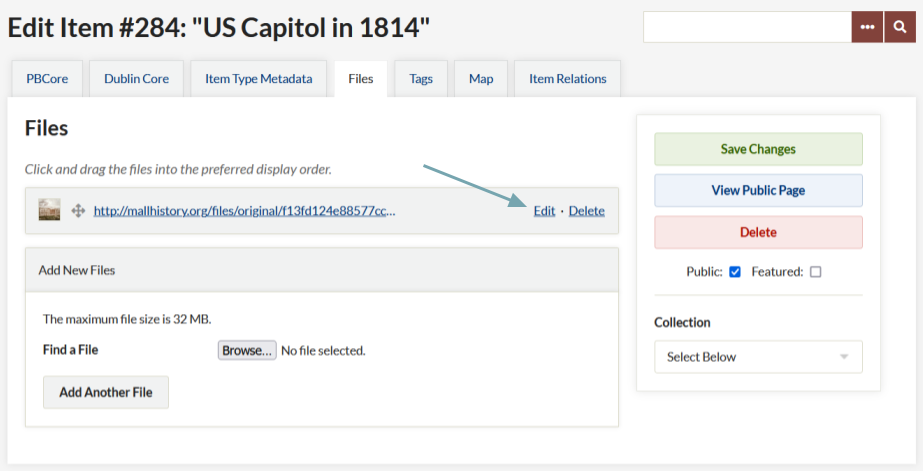
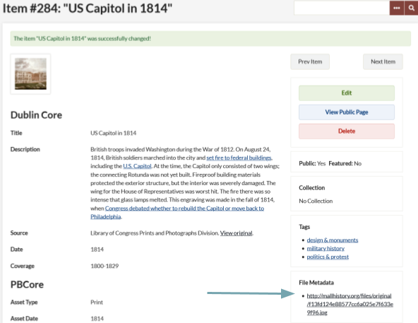
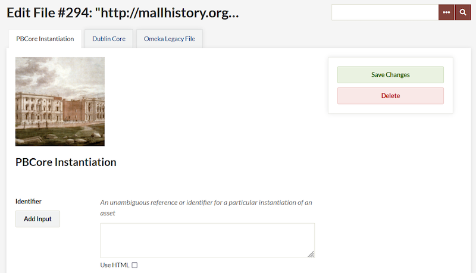
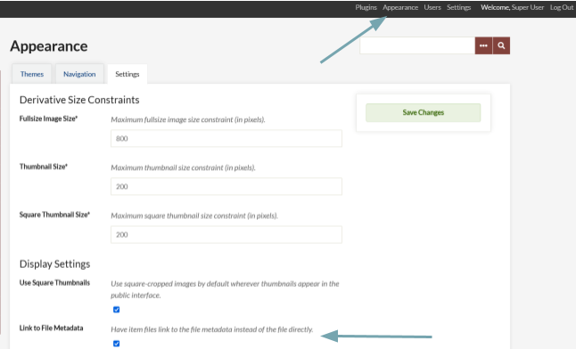
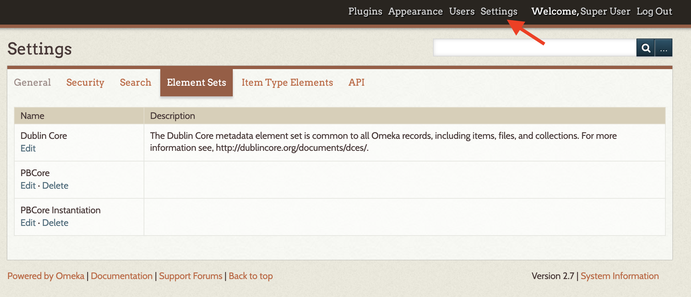

# PBCore

The [PBCore plugin](https://omeka.org/classic/plugins/PBCore2/){target=_blank} for Omeka Classic adds elements from the [PBCore Metadata standard](https://pbcore.org/){target=_blank} to your Omeka site. This metadata standard, developed for audiovisual content, can be used to describe items and files. It does not replace the Dublin Core metadata elements in your Omeka Classic site.

## Configuration

No additional configuration is required for this plugin.

## Adding an Item

For guidance on using the PBCore metadata standard, please see the [PBCore website](https://pbcore.org/tutorials){target=_blank}.

Once the plugin is installed, PBCore elements are available in their own tab when a user is either Adding or Editing an Item (on the same level as Item Type, File, Tags, and other metadata tabs).

Users can complete as much or as little of the PBCore as they wish. If you input a 'Title' and a 'Creator' in the PBCore element set, those fields will **overwrite any existing data in the DC metadata** to facilitate browsing and sorting. (This will be particularly important to those using a media importer, such as the [YouTube Import](https://omeka.org/classic/plugins/YouTubeImport/){target=_blank} and [Vimeo Import](https://omeka.org/classic/plugins/VimeoImport/){target=_blank} plugins, because those plugins harvest any available metadata from the source site to the DC fields.)

Each PBCore element has a description of the element (from the metadata standard) and an input field below. Use the checkbox below the field to use HTML formatting in this field. For elements with multiple values, use the `Add Input` button on the left to create additional fields.  

One of the features of PBCore is the use of related sub-elements, such as `Contributor` and `Contributor Role`. If you have more than one value to add to an element that has a related sub-element, use the `Add Input` button to create a field for each value and be sure to enter the values in a consistent order so that they are properly associated. 

The nested elements will be captured in the PBCore XML output from Omeka. However, in the web and admin interface, the sub-elements will be displayed as distinct.

### Controlling Displayed Metadata with Hide Elements Plugin

You may want to use the [Hide Elements plugin](https://omeka.org/classic/plugins/HideElements/){target=_blank} along with PBCore in order to manage the possible duplication of the Title and Creator fields between the PBCore element set and the Dublin Core element set.

When configuring the Hide Elements plugin, duplicate fields can be hidden on the Add Item form, the administrative view, the public view, and the search. Using the configuration form, you can customize where and who sees both the Dublin Core and PBCore elements.

### Adding Item File Metadata

In addition to the item metadata, PBCore offers instantiation metadata fields for the item files. Instantiation metadata can only be added if there is a file uploaded to the Omeka system. For files that exceed the size of the web interface upload limit, or to add many files at once, users can install and make use of the [Dropbox plugin](Dropbox.md). 

[YouTube Import](https://omeka.org/classic/plugins/YouTubeImport/){target=_blank} and [Vimeo Import](https://omeka.org/classic/plugins/VimeoImport/){target=_blank} plugins create an embed of the video file without actually importing the file. The importers spoof the creation of a file so that you can add instantiation metadata to the import. (Note, when using these importers you will want to copy any 'Title' and 'Creator' data into the PBCore fields to preserve that information because the plugin is designed so that the PBCore information **overwrites the DC metadata for those fields**.)

To access the instantiation fields, first add your file to the item and save. Once your file is attached to an item, you can edit the file metadata by clicking on "Files" from the top item menu and then "Edit" to the right of the desired file. Additionally, if you are returning to add instantiation metadata to an item with attached files, the links to the file metadata appear in the right hand detail column of each item page.

To assure that visitors can access the instantiation metadata that is connected to the files, go to the site-wide Appearances page and then to the Settings tab. Under settings check the box under "Display Settings" for "Link to File Metadata."

## Uninstalling

While you can uninstall PBCore just like any other plugin, doing so will not remove the PBCore elements from your Omeka site. 

**Proceed with caution:** only uninstall if you are sure that you no longer need the element sets and the associated data. 

You will need to remove the element sets manually to clear the data from the site. You will also need to delete the element sets prior to reinstalling the plugin.

To remove the element sets, go to Settings in the upper navigation of the admin dashboard (this area is only available to Super Users). Click on the Element Sets tab. You can then Delete the PBCore and the PBCore Instantiation Element Sets. 

