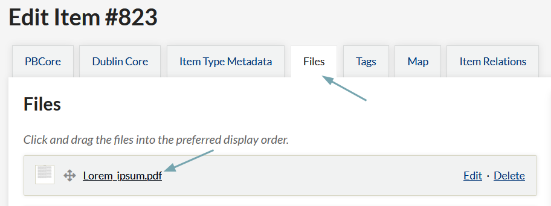
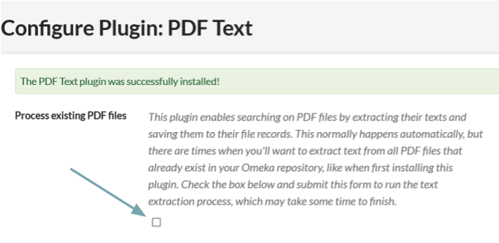

# PDF Text

The [PDF Text plugin](https://omeka.org/classic/plugins/PdfText/){target=_blank} enables searching on PDF files uploaded to an Omeka Classic item by extracting their texts and saving them to the file records. PDF Text strips out images and layout in the original file, leaving only searchable text.


## System requirements

PDF Text requires the `pdftotext` utility, which is part of the [poppler-utils](https://pypi.org/project/poppler-utils/){target=_blank} package. You can install it yourself from the command line:

```pip install poppler-utils```

You may need to contact your server administrator to install it. 

You can then install the PDF Text plugin from the plugins directory.

## Using the PDF Text module

- Add PDF file(s) to a new or existing item
- Save the item
- PDF Text will extract any text layers from the PDF(s) and input the text to the Text metadata field attached to the file (not the item). 



You can view the extracted text in the admin side, on the File page, or when editing the file, on the "PDF Text" tab. On the public side, this field will show on the file display.

### Configure


The PDF Text "Configure" page, accessible from the Plugins page, allows you to run a batch-text-extraction process on all PDF files already in your Omeka database. 

Check the *Process Existing PDF files* box and save changes. This will run the text extraction process on all PDF file attachments.