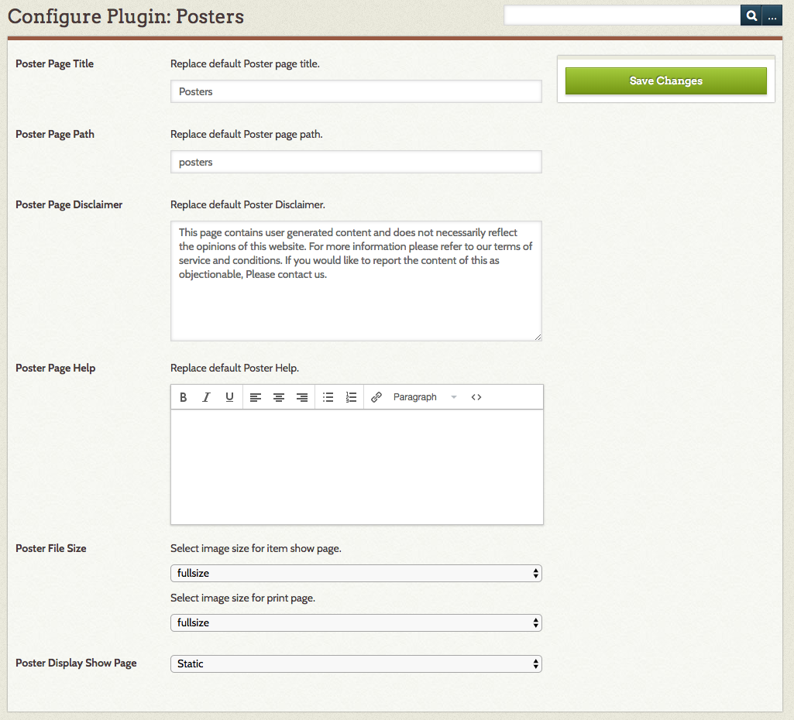
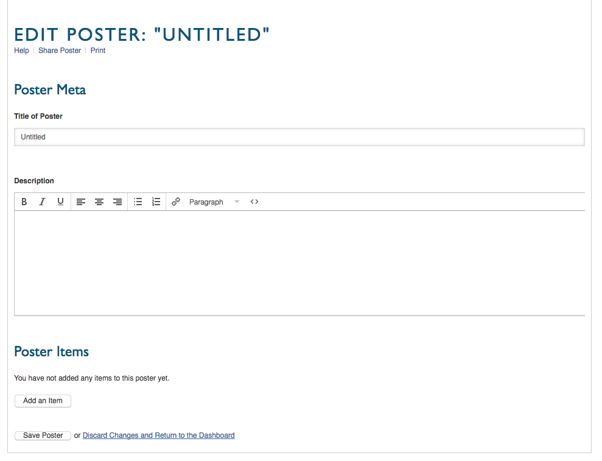
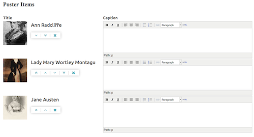
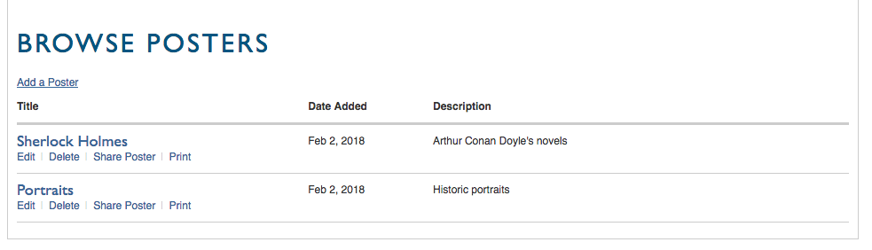
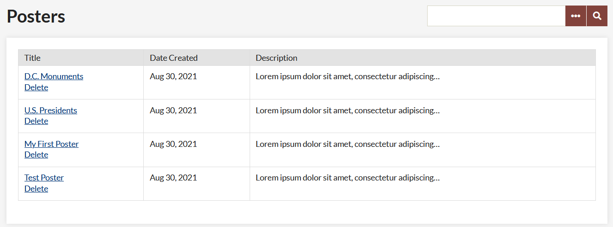

# Posters

[Posters](https://omeka.org/classic/plugins/Posters/){target=_blank} are a simple, lightweight way for users on your Omeka Classic site to interact with your content by selecting items to gather together into a sequential presentation, with an overall description and captions for items.

You must have [Guest User](GuestUser.md) installed to use Posters.

## Configure

To configure Posters, go to the Plugins button in the top navigation. Scroll down to Posters and click the blue "Configure" button. The page should load with the following options: 

**Poster Page Title:** Change the title of the posters page and how it is populated in the public navigation.

**Poster Page Path:** the slug for the poster page (what shows up in the url, so `youromekasite.org/posters`).

**Poster Page Disclaimer:** Edit, replace, or remove the default disclaimer that appears at the bottom of every poster page.

**Poster Page Help:** Edit, replace, or remove the default text for posters/help, accessible to users when they are creating or editing a poster.

**Poster File Size:** Use these two drop-down menus to indicate the image size (fullsize or thumbnail) for display on the public page and when printing posters.

**Poster Display Show:** Page From this drop-down, you can choose whether posters display online as a static list of items or a carousel slide show. Note that the carousel display is designed for shorter descriptions and posters of at least two items.

### Default Texts

If you replace the default texts and later want to restore them, they are as follows:

**Poster Page Disclaimer** 

`This page contains user-generated content and does not necessarily reflect the opinions of this website. For more information, please refer to our terms of service and conditions. If you would like to report the content of this as objectionable, please contact us.`

**Poster Page Help**  

`<h2>Your Posters</h2> To build a poster, you may use any public item in in this website and add a caption.  
Click the button that says "New Poster." Assign a title to your poster, add a short description. Click the tab that says "Add an Item" and select any item that you wish to include in your poster. Continue adding items and captions. 
 
 Be sure to save your poster. You may return to edit your poster at any time. 
 
You may print this poster, or share it by email.
`

## Working with Posters

Users add, edit, share, print, and delete posters from the public side of your Omeka installation. Once the plugin has been installed, there should be link in your main navigation menu on the public side called “Posters” (or the text you entered in the Poster Page Title field when configuring the plugin.

Note that logged-in users will only see their own posters. Non-logged in people who navigate to youromekasite.org/posters will see all posters with the option to print any of them.

### Build a Poster
To create a new poster, go to the public posters page and click the Add a Poster button. This will take to you to a new page where you can create your poster.

Enter the title of the poster. The title will display on the posters page as well as at the top of the printed version.

Add a description. The first 200 characters will appear on the Posters page. To add items, click the Add an Item button. This will open a pop-up window which allows you to browse or search your items in order to add them. Click on an item and then click the brown Select Item button to add it to your poster.

Every item you add will have a caption field. Bear in mind that in carousel view text does not wrap, so your caption will need to be concise.

Once you have added a number of items, you can change their order by using the buttons located between the thumbnail file and the caption field. These buttons are: move to top (double up); move up one (single up); move down one (single down); move to bottom (double down); delete item (X).

Finally, you may save your poster or discard all changes and return to the dashboard.

To view your poster, click the poster title from the Posters page.

**Edit** You can access this same page at any time by clicking edit under the poster title on the Posters page.

**Delete** If you click delete below the title on the posters page, you will be asked to confirm before the poster is deleted. To cancel, simply click the back button in your browser.

**Share Poster** Takes you to a new page where you can enter an email address; poster Builder will send a link to your poster’s webpage to that address with the message “Username shared a poster with with you. Click here to view the poster: `[link]`.”

**Print** Takes you to a new page displaying your poster content all on one page, suitable for printing.

### Manage Posters
Logged-in users can manage their posters from the public side of the Omeka installation. While logged in, users of all levels will only see their own posters on the public side. However, they can access all posters through the Posters tab on the left-hand navigation on the admin dashboard.

Administrators and Super Users can delete posters created by any user via the Posters tab on the left side of the admin dashboard. You will be asked to confirm before the item is deleted.

