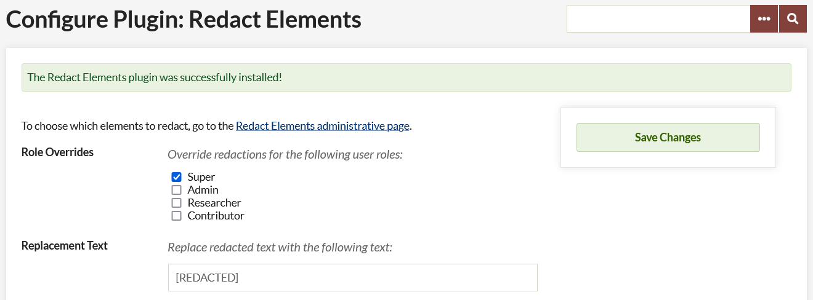
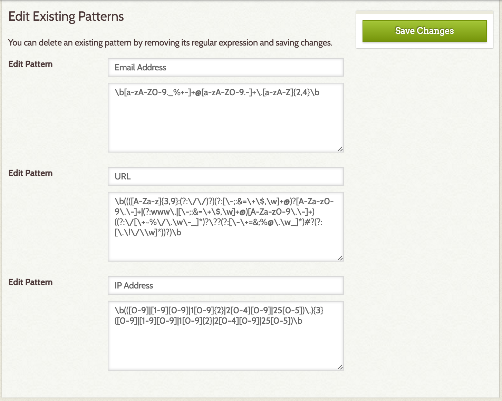
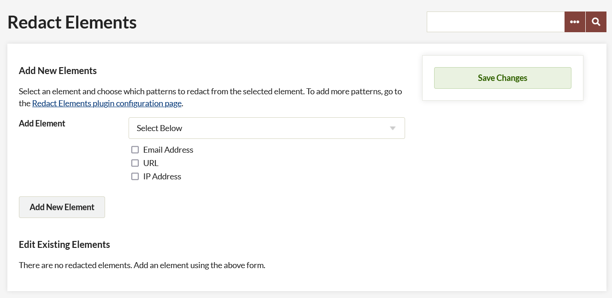

# Redact Elements

The [Redact Elements plugin](https://omeka.org/classic/plugins/RedactElements/){target=_blank} allows enabled users of an Omeka Classic install to redact specific character sequences in a given element field in Omeka. For example, any instance of an email address in the Contributor or Source field could be replaced with `[Redacted].` You can select which elements have redactions applied, and which redactions to use.

Text sequences to be redacted are specified using regular expressions. For more information on regular expressions, see [regularexpressions.info](http://www.regular-expressions.info){target=_blank}. The plugin comes with regular expressions for IP addresses, email addresses, and urls; you can can add other patterns.

## Configuration

Following [installation](../Admin/Adding_and_Managing_Plugins.md), configure the plugin by selecting Plugins from the top navigation of your admin and clicking on the Configure button for Redact Elements.

From here you can:

-   Set which user roles are able to edit redacted elements and patterns;
-   Specify what text replaces redacted information;
-   Add new patterns for redaction.

Only Super users and Administrators can administer the plugin. By default, only Super users see the redacted text, instead of the redaction message, on the Admin side. 

The *Role Overrides* check boxes allow you to enable Administrators, Researchers, and Contributors to view redacted information on the admin side of the installation.

To give or remove redaction permission, simply check the box next to the user role.

You can change the replacement text for reacted text patterns in the *Replacement Text* field. The default replacement is `[REDACTED]`.

Adding or editing patterns requires knowledge of regular expressions. 

To Add a New Pattern, you must give the pattern a *label*, for use on the administration page (see below). In the following field, enter the *regular expression*. 

Existing patterns in the plugin are:

- email address
- URL
- IP Address

You can remove any of these existing patterns by deleting the label and regular expression.

Be sure to save changes before leaving the page.

## Administration

Redaction implementation takes place in the Redact Elements administrative page, accessible to enabled users (see above) from the left navigation bar or from the link in the configure plugin page.

To add a redaction:

-   Select the field in which the redacted text may appear from the drop-down menu labeled “Add Element”.
    - This drop-down includes all default element sets for your installation as well as custom element sets.
-   Select one or more of the patterns from the checkbox list below.  The patterns are displayed only by their labels from the configuration settings.  
-   To implement, click save changes.

You can add multiple redactions at a time by clicking the Add New Element button, which will load another drop-down menu and checkbox set.

To delete a redacted element, uncheck all its patterns and save changes.
