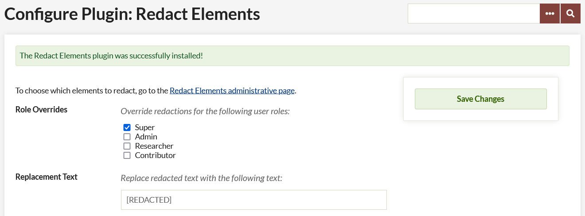
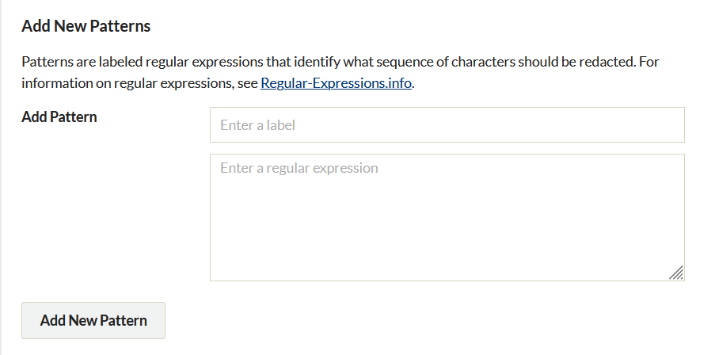
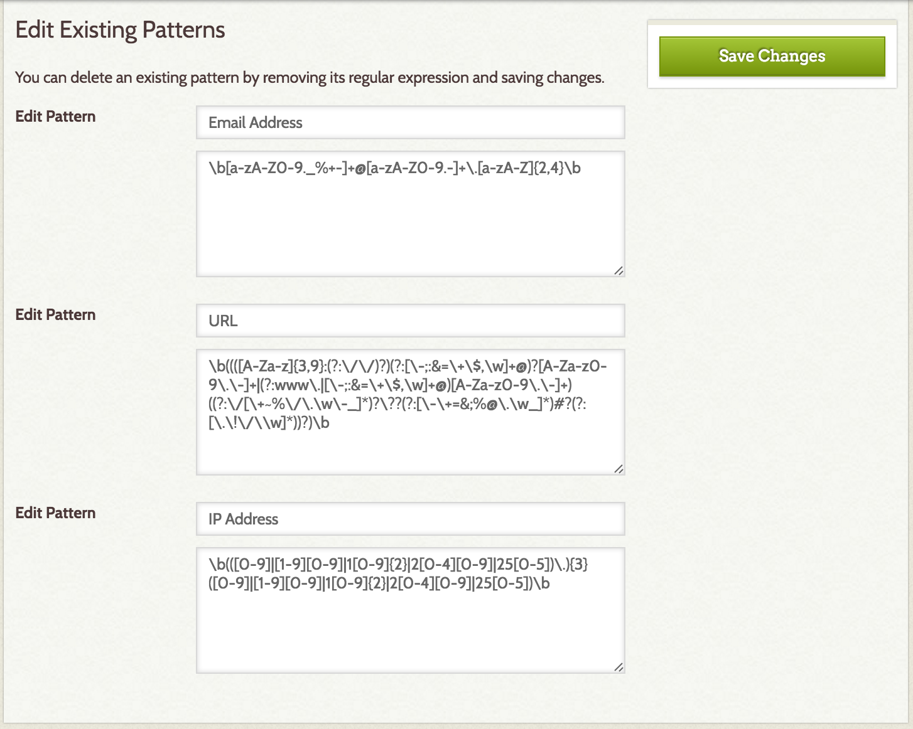
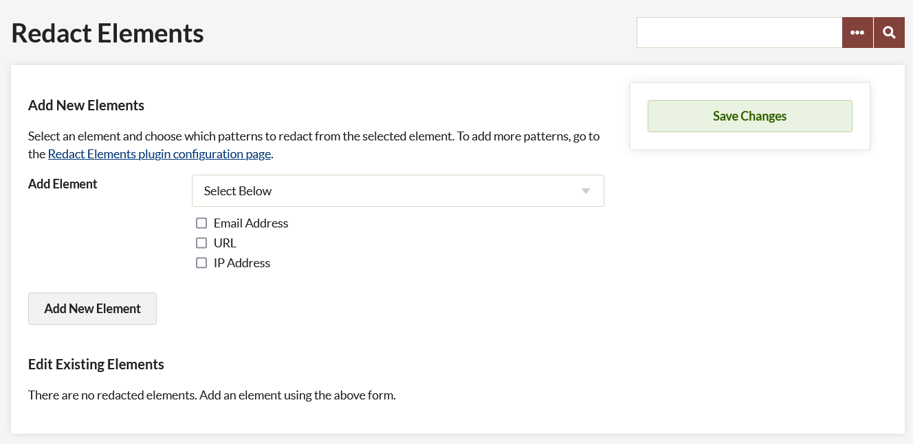

# Redact Elements

The [Redact Elements plugin](https://omeka.org/classic/plugins/RedactElements/){target=_blank} allows selected users of an Omeka Classic installation to redact information from element fields in Omeka, using regular expressions to match character sequences. For example, any instance of an email address in the Contributor or Source field could be replaced with "[Redacted]". You can select which elements have redactions applied, and which redactions to use.

Text sequences to be redacted are specified using regular expressions. For more information on regular expressions, see [regularexpressions.info](http://www.regular-expressions.info){target=_blank}. The plugin comes with regular expressions for IP addresses, email addresses, and urls; you can can add other patterns.
Text sequences to be redacted are specified using regular expressions. For more information on regular expressions, see [regular-expressions.info](http://www.regular-expressions.info){target=_blank}. The plugin comes with pre-written regular expressions for IP addresses, email addresses, and URLs; you can can add other patterns.

## Configuration

Following [installation](../Admin/Adding_and_Managing_Plugins.md), configure the plugin by selecting "Plugins" from the top navigation of your admin and clicking on the "Configure" button for Redact Elements.

From here you can:

-   Set which user roles are able to edit redacted elements and patterns
-   Specify what text replaces redacted information
-   Add new patterns for redaction.

Only Super Users and Administrators can configure the plugin. By default, only Super Users see the original unredacted text, instead of the redaction message, on the admin side. 

The "Role Overrides" checkboxes allow you to enable Administrators, Researchers, and Contributors to view redacted information on the admin side of the installation.

To give or remove redaction permission, simply check the box next to the user role.

You can change the replacement text for reacted text patterns in the "Replacement Text" field. The default replacement is `[REDACTED]`.

To "Add a New Pattern", you must give the pattern a **label**, for use on the administration page (see below). In the following field, enter the **regular expression**. 

Existing patterns in the plugin are:

- Email address
- URL
- IP address.

You can remove any of these existing patterns by deleting the text in the pattern box and saving the page.

Be sure to save your changes before leaving the page.

## Administration

The Redact Elements administrative page now appears in the left-hand navigation bar. There is also a link to this page from the plugin configuration page. 

To add a redaction:

-   Select the metadata field in which the redactable text may appear, from the dropdown menu labeled “Add Element”.
    - This dropdown includes all default elements for your installation as well as custom elements, alphabetically. Be sure to select the correct element for your intended element sets, as some names can be similar but come from different vocabularies. 
-   Select one or more of the patterns from the checkbox list that appears below the element dropdown. The pattern labels appear, without the regular expressions.  
-   You can add multiple redactions at a time by clicking the Add New Element button, which will load another drop-down menu and checkbox set. You can add multiple redactions to one element, or the same redaction to many elements.
-   To implement your choice, click the "Save Changes" button.

To delete a redaction from an associated element, uncheck all its patterns and save your changes.
