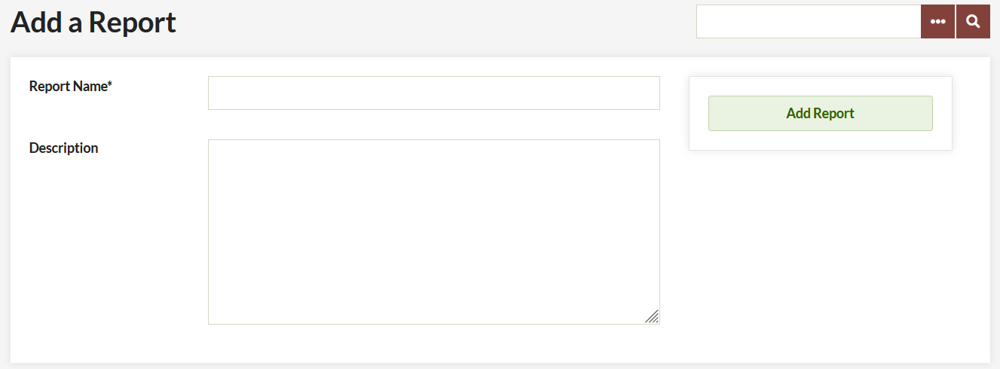
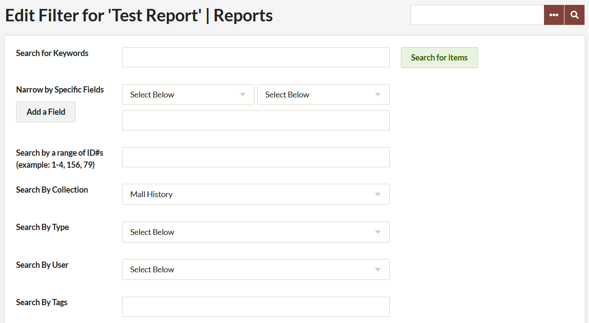
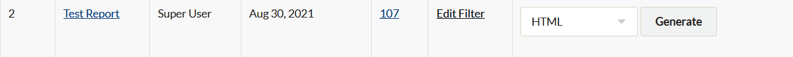
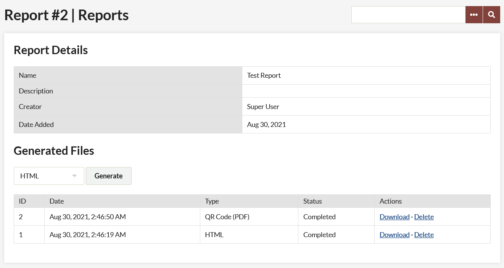

# Reports

A report generates a named set of items in Omeka Classic. You can create reports that encompass all items in the system, or choose to report on one specific item, or anything in between. Reports will automatically update as new items are added to Omeka.

The [Reports plugin](https://omeka.org/classic/plugins/Reports/){target=_blank} allows users to create reports of Omeka items in an HTML list and a PDF of QR codes [QR Codes](http://en.wikipedia.org/wiki/QR_Code){target=_blank} (10 per page, by default), as well as other formats you can customize in the plugin files.

## Instructions

Note that a new Reports directory will be created once the plugin is uploaded to the plugin directory on your server be saved: `OmekaSitedirectory/files/reports/`. This directory **must be writable** by the server for reports to be generated.

1. After you have [installed](../Admin/Adding_and_Managing_Plugins.md) the plugin, a Reports tab will appear on the left navigation of the admin Dashboard (`admin/Reports`)
2. Click the link in the top-left of the screen that reads "Add a Report."
3. On the "Add" page, choose a name and a description for the report.
   
4. Choose which items to include in the Report on the "Edit Filter" page. This is essentially creating an advanced item query; you need to choose criteria to filter the items for this report. If you leave the form blank, all items in the installation will be included in the report. Click Search to create the report. 

5. The new report now appears on the admin/reports page.

### Generating a File

Once you have created a report, you can publish report files in HTML or as QR Codes.

1.  From the admin/Reports page, To generate a file, you can either click the "Generate File" button on the main Reports page, or a specific report's details page (accessible by clicking the report's name).
   
1.  The drop-down menu next to the “Generate File” button allows you to select the type of report that will be generated, HTML or PDF for QR Codes.

The report will be generated in the background. Refresh the report details page as the report’s status changes from “In Progress” to “Completed.”

### Viewing a File

All report files with a status of "Completed" on the report details page have two links, allowing you to view or delete the file.



*View file* allows you to view the generated file in your browser. You can then save the file to your local machine, and/or leave it on your Omeka server.

*Delete file* deletes the generated file from your Omeka server. Before clicking the "Delete file" link, make sure you have saved a copy of the file if you want to keep it.

## Extending

You can add new report output formats or edit the existing ones to add or change the functionality of the reports plugin. The existing formats give examples of how to accomplish PDF and HTML output, but you can add other formats (text, XML, etc.) by creating new report generators.

### Adding New Formats 
Report generators are stored in `Reports/libraries/Reports/ReportGenerator`, and each generator is a PHP class extending `Reports\_ReportsGenerator.`

All the generation takes place in the function `generateReport()`. For examples of how to generate reports, study the two included report generators.

### Altering Existing Formats
The included formats are an HTML and a PDF output. Both can be modified from their original forms to suit specific needs.

When modifying a included report format, first make a copy of the file, and change both the file name and the class name (so, for example, you could copy `HTML.php` to `HTMLCustom.php`, and change the class name to `Reports\_ReportGenerator\_HTMLCustom`).

The HTML report format is simple to edit. By default, all the elements in all element sets are printed. You can replace this behavior with printing only specific elements or specific element sets. This is accomplished with the function `\_outputSetElements()`. It takes three arguments. The first is the Item which will be printed, the second is the name of the element set to print, and the third is an array of the specific elements to print.

For example, this is the code that prints all elements for all sets (the default: 

```
// Output all the metadata for all the element sets
foreach($sets as $set) :
    $this->_outputSetElements($item, $set->name);
endforeach;
```
In comparison, this would cause only Dublin Core elements to be printed:


```
// Output all Dublin Core elements
$this->_outputSetElements($item, 'Dublin Core');
```

Finally, this would cause only Dublin Core Item elements to be printed, if any:

```
// Output all Dublin Core Title elements
$this->_outputSetElements($item, 'Dublin Core', array('Title'));
```

In this way, you can easily create a customized HTML report format. The PDF output format can also be edited an customized, but requires some more advanced techniques.
