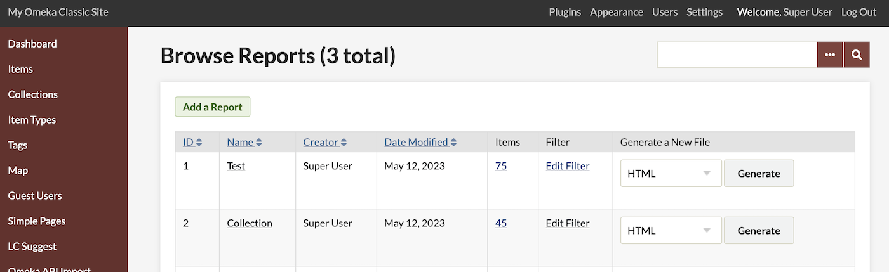
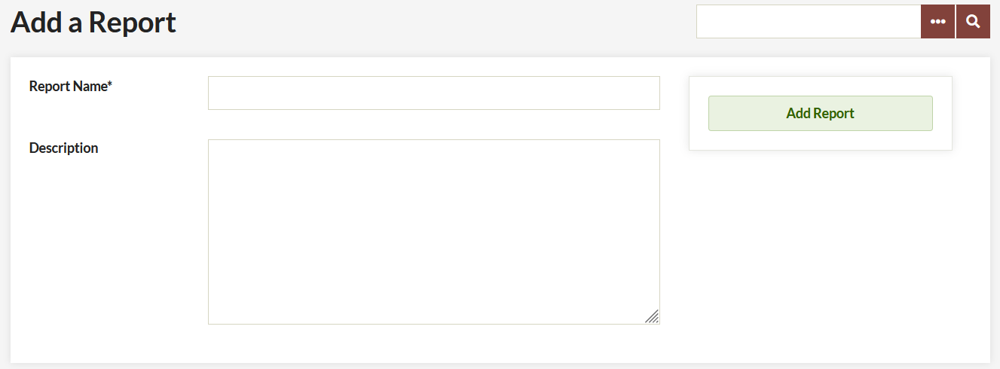
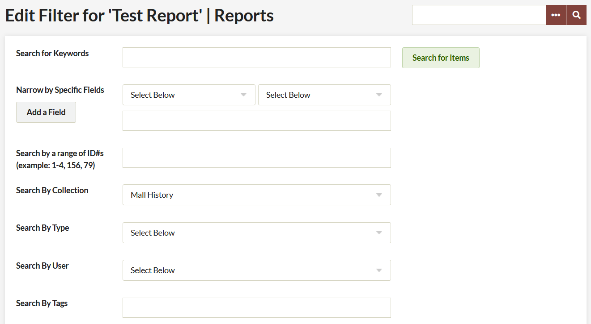
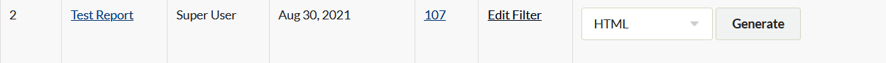
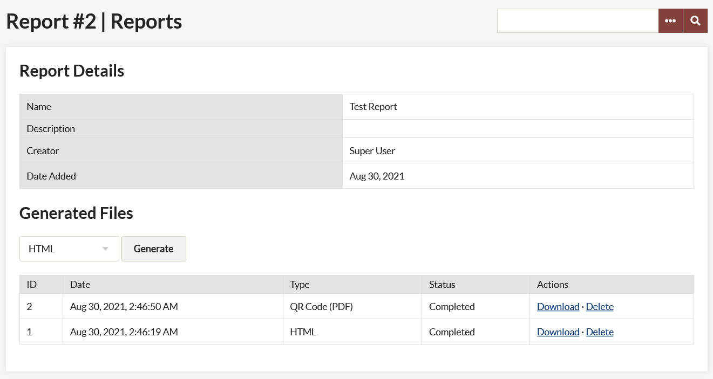

# Reports

The [Reports plugin](https://omeka.org/classic/plugins/Reports/){target=_blank} allows users to create reports of Omeka items. The plugin can generate an HTML list, a PDF of [QR Codes](http://en.wikipedia.org/wiki/QR_Code){target=_blank}, and other formats you can customize in the plugin files.

You can create reports for all items in the installation, one specific item, or anything in between. Reports will automatically update as new items are added to Omeka.



## Instructions

A new Reports directory will be created once the plugin is installed: `yourinstallation/files/reports/`. This directory **must be writable** by the server for reports to be generated. You may need to [modify the folder permissions](../Installation/Setting_Directory_Permissions.md) using an FTP client or with the command line. 

1. After you have [installed](../Admin/Adding_and_Managing_Plugins.md) the plugin, a "Reports" link will appear in the left-side navigation bar of the administrative dashboard (`yourinstallation/admin/Reports`).
2. On this page, click the green "Add a Report" button in the top-left of the screen.
3. On the "Add" page, fill out a name and a description for the report. The name field is required, while the description is optional. Neither can be edited after you create the repot, and reports cannot be deleted after creation. Click the "Add Report" button to save this page. 
   
4. Choose which items to include in the Report on the "Edit Filter" page. This is essentially creating a search query; you need to choose criteria to filter the items for this report. If you leave the form blank, all items in the installation will be included in the report. Filters can be edited later. Click "Search for items" to set up the report. 

5. The new report now appears in the table on the Reports page. This table will show the number of items included in the report based on the current filtering settings. There is also a link to edit the filters. You can sort the table by the report ID, name, date of modification, and owner. 

### Generate a file

Once you have created a report, you can publish report files in HTML, or as a PDF of QR codes.

1.  From the "Reports" page, to generate a file, you can either click the "Generate File" button on the main Reports page, or go to a specific report's details page (by clicking the report's name).
   
1.  The drop-down menu next to the “Generate File” button allows you to select the type of report that will be generated, HTML or PDF for QR Codes (10 per page, by default).

The report will be generated in the background. On the report's details page there will be a "Generated Files" section with a table of past files. Refresh this page to see whether the status has changed from "In Progress" to "Completed".

### View a file

All generated files with a status of "Completed" on the report details page have two links, allowing you to view or delete the file that was created.



"View file" allows you to view the generated file in your browser. You can then save the file to your local machine, and/or leave it on your Omeka server.

"Delete file" deletes the generated file from your Omeka server. Before clicking the "Delete file" button, make sure you have saved a copy of the file if you want to keep it.

## Extensions

You can add new report output formats or edit the existing ones. The existing formats are PDF and HTML output, but you can add other formats (text, XML, etc.) by creating new report generators.

### Adding new formats 

Report generators are stored in `Reports/libraries/Reports/ReportGenerator`, and each generator is a PHP class extending `Reports\_ReportsGenerator.`

All the generation takes place in the function `generateReport()`. For examples of how to generate reports, study the two included report generators.

### Altering existing formats

The included formats are HTML and PDF output. Both can be modified from their original forms to suit specific needs.

When modifying a included report format, first make a copy of the file, and change both the file name and the class name (so, for example, you could copy `HTML.php` to `HTMLCustom.php`, and change the class name to `Reports\_ReportGenerator\_HTMLCustom`). Do not use other underscores in your file and class names.

The HTML report format is simple to edit. By default, all the elements in all element sets are printed. You can change this behavior to print only specific elements or specific element sets. This is accomplished with the function `\_outputSetElements()`. 

It takes three arguments. The first is the item that will be printed, the second is the name of the element set to print, and the third is an array of the specific elements to print.

For example, this is the code that prints all elements for all sets (the default): 

```
// Output all the metadata for all the element sets
foreach($sets as $set) :
    $this->_outputSetElements($item, $set->name);
endforeach;
```

In comparison, this would cause only Dublin Core elements to be printed:

```
// Output all Dublin Core elements
$this->_outputSetElements($item, 'Dublin Core');
```

Finally, this would cause only Dublin Core Item elements to be printed, if any:

```
// Output all Dublin Core Title elements
$this->_outputSetElements($item, 'Dublin Core', array('Title'));
```

In this way, you can create a customized HTML report format. The PDF output format can also be edited and customized, but requires some more advanced techniques.