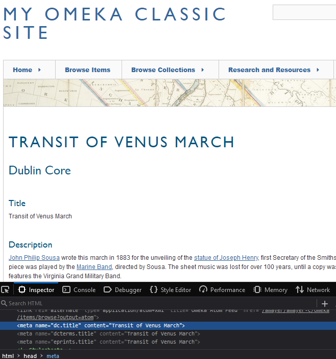

# Resource Meta

The [Resource Meta plugin](https://omeka.org/classic/plugins/ResourceMeta/){target=_blank} allows installation users to output resource metadata (items, item sets, and media) as [`<meta>` elements in the HTML](https://www.w3schools.com/tags/tag_meta.asp){target=_blank} of their site pages. A metadata property, such as `dcterms:creator`, can be set to output as a meta tag, such as `<meta name="dcterms.creator" content="Shakespeare, William">` inside the `<head>` tag of the public page. 

Resource Meta settings can be modified by users at the Super and Admin levels. 

Meta elements are used for search engine optimization and indexing of the most relevant page content. This module offers commonly-used meta elements for the indexing and discoverability of academic resources, including BE Press, Highwire Press, EPrints, and PRISM, as well as Dublin Core Elements and Dublin Core Terms for other resource types.

## Mapping metadata to meta tags

Select Resource Meta from the Plugins list in the left-hand menu. You will see all of the installation's element sets listed on a page, including Dublin Core and item-type metadata. 

Click the "Edit" link shown under each element set to modify its meta settings. You will be taken to a display of all of the element set's properties, with a dropdown to select from available meta elements. 

Every field in the element set can be mapped to one or more meta elements. Your choices are:

- BE Press
- Dublin Core Elements
- Dublin Core Terms
- Highwire Press
- EPrints
- PRISM.

Select meta tags manually from the available dropdown. Searching for words such as "title" and "subject" can help narrow down the results. 

To erase a current mapping, press the "X" shown on the mapping. Be sure to save your edits. 

To check that the plugin is working as intended, go to a public page for an item using the element set with mappings. View the page source and look inside the `<head>` tag for `<meta>` elements corresponding to your settings. 

## Uses

If you are using Omeka to make academic resources available, for example with intent to [have items indexed by Google Scholar](https://scholar.google.com/intl/en/scholar/inclusion.html#indexing){target=_blank}, you may wish to select one of the four publishing options, all of which are supported. [More information about these four options and academic resource discoverability can be found here](http://div.div1.com.au/div-thoughts/div-commentaries/66-div-commentary-metadata){target=_blank}.

For another example, if you wish your Omeka items to be [indexed and imported by Zotero](https://zotero-manual.github.io/adding-items/#generic-translators){target=_blank}, you may wish to use Highwire Press, Dublin Core, and PRISM. 
