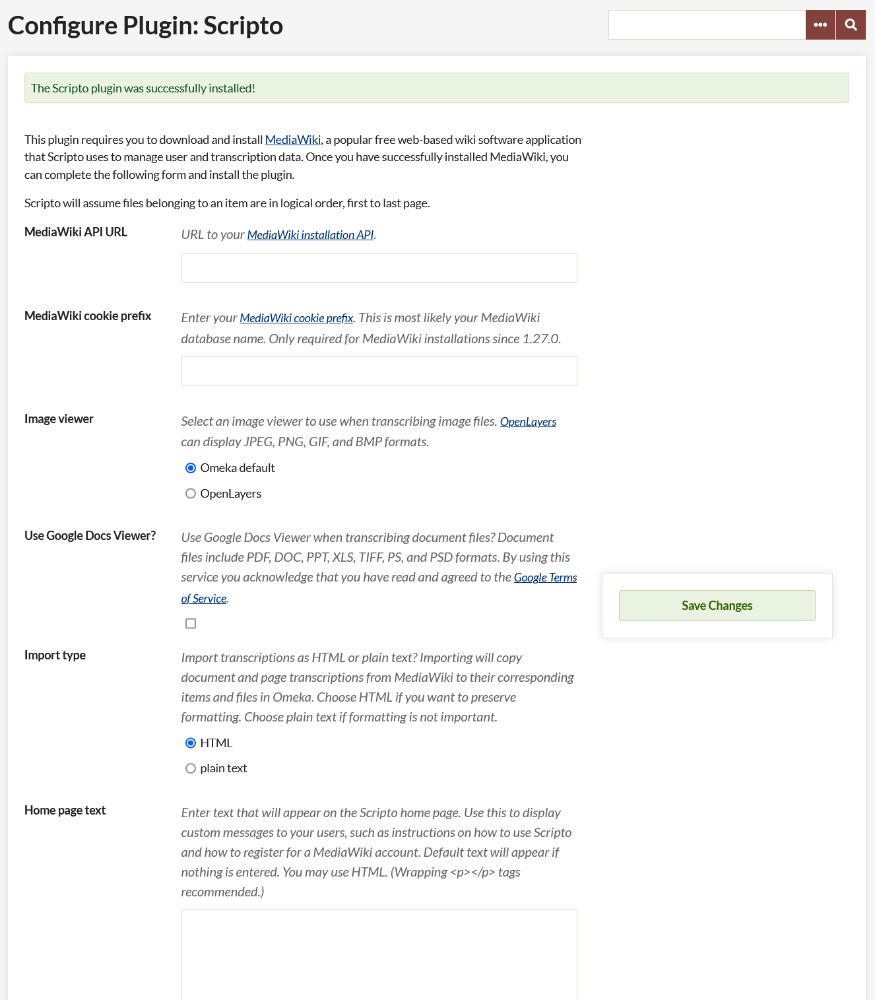

# Scripto

The [Scripto plugin](https://omeka.org/classic/plugins/Scripto/){target=_blank} allows you to crowdsource the transcription of your Omeka Classic content. It adds a feature rich interface to the admin and public sides that includes many features from [MediaWiki](http://www.mediawiki.org/wiki/MediaWiki){target=_blank}, the software behind [Wikipedia](http://www.wikipedia.org/){target=_blank}. All items with files can be transcribed. For these purposes an item is a *document*, and an item's files are its *pages*.

## Features

With the Scripto plugin, users can:

-   Transcribe document pages
-   Discuss document pages
-   View contributions they've made
-   View recent transcription and discussion history
-   View the revision history of a page
-   View revisions of a page
-   View the difference between page revisions
-   Revert to a previous revision
-   Make a custom watchlist

In addition to this, administrators can:

-   Protect transcriptions and discussions
-   Edit protected transcriptions and discussions
-   Import transcriptions from MediaWiki as item and file metadata
-   View corresponding MediaWiki pages


## Installing MediaWiki

This plugin requires you or your system administrator to [download](http://www.mediawiki.org/wiki/Download){target=_blank} and [install](http://www.mediawiki.org/wiki/Installation){target=_blank} MediaWiki, a popular free web-based wiki software application that Scripto uses to manage user and transcription data. You should install MediaWiki in a separate directory from Omeka. It can be installed on another server and it must be accessible to the Web.

## Configuring Scripto

-   **MediaWiki API URL:** URL to your [MediaWiki installation API](http://www.mediawiki.org/wiki/API:Quick_start_guide#What_you_need_to_access_the_API){target=_blank}.
-   **MediaWiki cookie prefix:** the cookie prefix, most likely your database name.
	- `<dbname>` if a table prefix is not used, -or-
	- `<dbname>_<tableprefix>_` if a table prefix is used (the trailing underscore is *required* for the cookie to work)  
	NB: you can find these by looking in the LocalSettings file in the root of the server directory for your MediaWiki installation. You want the values of `$wgDBname` and `$wgDBprefix` (if it exists)
-   **Image viewer:** Select an image viewer to use when transcribing image files. [OpenLayers](http://openlayers.org/){target=_blank} and [Zoom.it](http://zoom.it/){target=_blank} can display JPEG, PNG, GIF, and BMP formats. Zoom.it can also display TIFF and ICO formats. By using Zoom.it you acknowledge that you have read and agreed to the [Microsoft Zoom.it Terms of Service](https://docs.microsoft.com/en-us/sysinternals/downloads/zoomit){target=_blank}.
-   **Use Google Docs Viewer?:** Use Google Docs Viewer when transcribing document files? Document files include PDF, DOC, PPT, XLS, TIFF, PS, and PSD formats. By using this service you acknowledge that you have read and agreed to the [Google Docs Viewer Terms of Service](https://policies.google.com/terms?hl=en){target=_blank}.
-   **Import type:** Import transcriptions as HTML or plain text?Importing will copy document and page transcriptions from MediaWiki to their corresponding items and files in Omeka. Choose HTML if you want to preserve formatting. Choose plain text if formatting is not important.
-   **Home page text:** Enter text that will appear on the Scripto home page. Use this to display custom messages to your users, such as instructions on how to use Scripto and how to register for a MediaWiki account. Default text will appear if nothing is entered. You may use HTML. (Wrapping paragraph tags recommended.)



## Quick Start

Once you've installed MediaWiki and the Scripto plugin you can begin transcribing document pages:

1.  Open an item page as normal (the item must have at least one file);
2.  Click on one of the pages (files) under "Transcribe This Item". You'll be taken to a user interface where you can view, transcribe, and discuss the selected page;
3.  Click "\[edit\]" beside "Current Page Transcription", an edit form will open;
4.  Transcribe the page and click "Edit transcription";

## Restricting Access

The Scripto interface is available to all users, but as a MediaWiki administrator you can restrict access to certain actions. By default, anonymous users can edit and revert pages. If you want to restrict these actions, you must [follow these
directions](http://www.mediawiki.org/wiki/Manual:Preventing_access#Restrict_editing_of_all_pages){target=_blank},
and your users must create MediaWiki user accounts (see below).

## Creating Accounts

Scripto uses a separate login procedure from Omeka, so non-anonymous users must have a MediaWiki account and administrators must manage them via MediaWiki. (We recognize that this is not ideal, but the [MediaWiki API](http://www.mediawiki.org/wiki/API:Main_page){target=_blank} does not provide the means to create accounts.) To create an account, users must:

1.  Go to the MediaWiki website
2.  Click "log in / create account" in the top-right corner
3.  Click "Create an account."
4.  Fill in the information and submit the form

If you do not want to allow anonymous account creation, you must [follow these directions](http://www.mediawiki.org/wiki/Manual:Preventing_access#Restrict_account_creation){target=_blank} and create accounts for all your users. To create user accounts, you must:

1.  Go to the MediaWiki website
2.  Click "Special pages" in the toolbar
3.  Click "Log in / create account" under "Login / sign up"
4.  Click "Create an account."
5.  Fill in the information and do one of the following:
    1.  Fill in a password and click "Create account"
    2.  Fill in an email and click "By e-mail" (The user will receive an email with instructions on how to complete their account creation. You can modify the account creation email by editing the MediaWiki:Createaccount-text page.)

## Importing

Once a document or page is transcribed, you may import the transcription from MediaWiki into Omeka. *Importing a document* stitches together all its page transcriptions and imports the result to the corresponding item. *Importing a page* imports to the corresponding file. All transcriptions are imported to the "Transcription" element in the "Scripto" element set.

Import is only available to MediaWiki administrators. After logging into Scripto via the Omeka interface, two buttons will appear on the transcription page: "Import Document" and "Import Page." Just click these buttons to import the transcription from MediaWiki to Omeka.

## Advanced Usage

### Record Client IP Address

Scripto does not record a client's IP address by default. All
modifications to pages will be set to the IP address of the server running Omeka. To record a client's IP address, you'll need to add the following code to LocalSettings.php:

```
$wgSquidServersNoPurge = array('127.0.0.1');
```

Where '127.0.0.1' is your server's IP address.

### Base64 Decoding
Scripto Base64 encodes document and page numbers to prevent incompatible MediaWiki title characters. Because of this, corresponding page titles in MediaWiki will be unusually named. You may place the following code in LocalSettings.php to make page titles human readable:


```
// Decode the MediaWiki title from Base64.
// http://www.mediawiki.org/wiki/Manual:Hooks/BeforePageDisplay
$wgHooks['BeforePageDisplay'][] = 'fnScriptoDecodePageTitle';
function fnScriptoDecodePageTitle(&$out, &$sk, $prefix = '.', $delimiter = '.')
{
    $title = strtr($out->getPageTitle(), '-_', '+/');
    if ($prefix != $title[0]) {
        return false;
    }
    $title = array_map('base64_decode', explode($delimiter, ltrim($title, $prefix)));
    $title = 'Document ' . $title[0] . '; Page ' . $title[1];
    $out->setPageTitle($title);
    return false;
}
```
