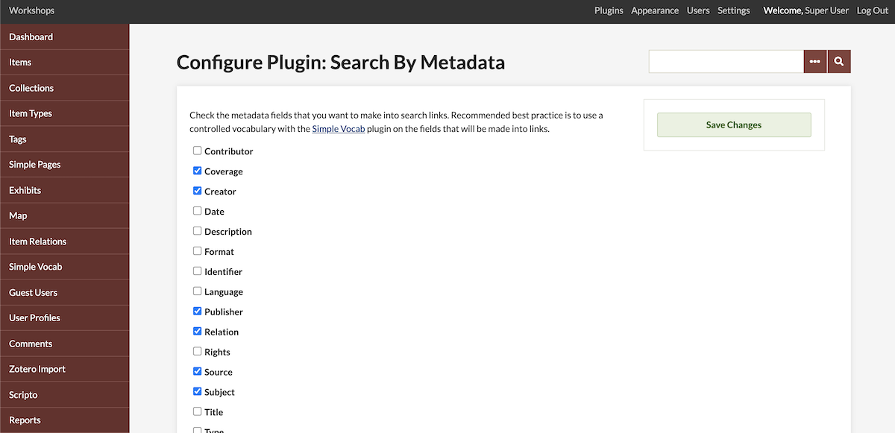
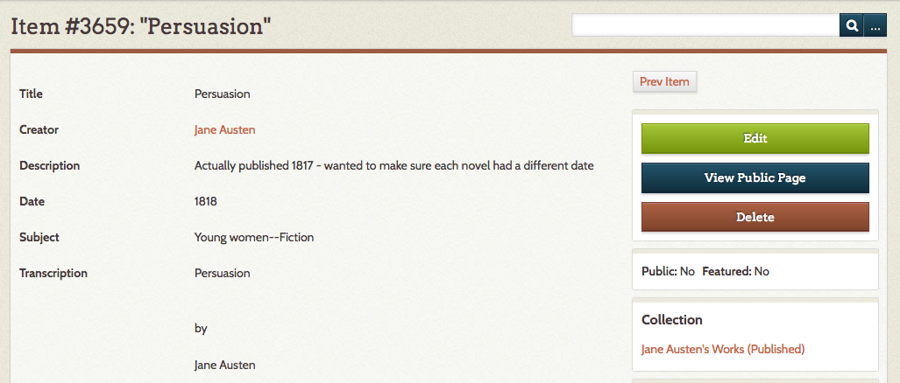

# Search by Metadata

The [Search by Metadata plugin](https://omeka.org/classic/plugins/SearchByMetadata/){target=_blank} makes it possible for visitors to your Omeka Classic site to see a browse page with items that share specific metadata (i.e., all items with Jackson Pollock in the Creator field). This plugin works very well with the Simple Vocab plugin for controlling metadata vocabulary.

In the Search by Metadata configuration, site administrators will choose which metadata elements fields will be linked.

Search by Metadata is one of the plugins discussed in the screencast [Managing Metadata](https://vimeo.com/176189711){target=_blank}. 

## Install and Configure

After installing the plugin, click Configure to select which metadata fields you wish to use to connect similar items. You may also want to install and configure the [Simple Vocab plugin](SimpleVocab.md), to control vocabulary and ensure that
items will be linked properly.

You may select as many or as few fields as you wish.

Once configured, the data entered in the fields you selected will be visible as links on the item page. When visitors click the metadata link, they will see a browse page displaying all other items with the exact value in that field.

For example, if you wish to use the plugin to link to all items with the same value in the Creator field, select the metadata field Creator when configuring. You may select as few or as many as you wish.

In the image below, see that when viewing items the value in the Creator field has become a link. Clicking that link brings you a list of all items with that exact value in that metadata field.

