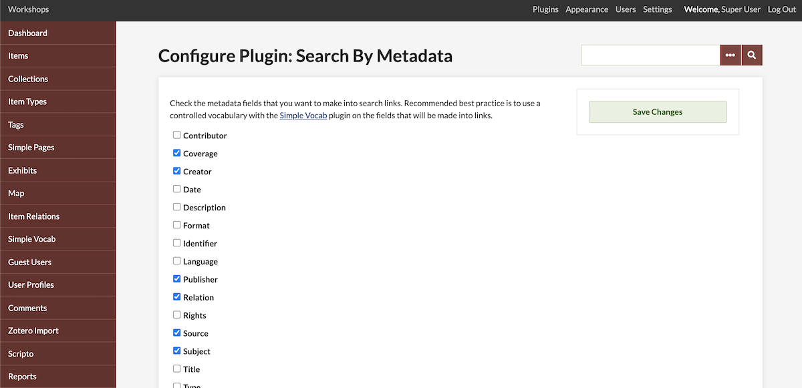
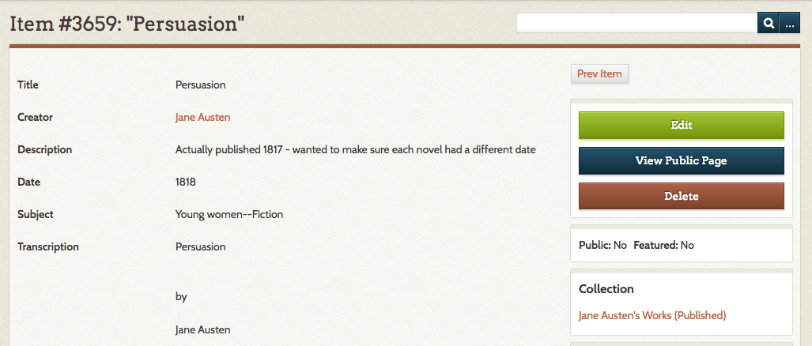

# Search by Metadata

The [Search by Metadata plugin](https://omeka.org/classic/plugins/SearchByMetadata/){target=_blank} makes it possible for visitors to your Omeka Classic site to navigate to browse pages with items that share specific metadata (i.e., all items with "Jackson Pollock" in the "Creator" field). This plugin works well with the [Simple Vocab plugin](SimpleVocab.md) for controlling metadata vocabulary.

This plugin adds links to all administrative and publis displays of items. 

In the Search by Metadata configuration, Super users can choose which metadata fields will be linked.

Search by Metadata is one of the plugins discussed in the screencast [Managing Metadata](https://vimeo.com/176189711){target=_blank}. 

## Configuration

After installing the plugin, click "Configure" in the Plugins page (accessible from the link at the top right of the administrative dashboard). 

This configuration page allows you to select which metadata fields you wish to use to connect similar items. You may also want to install and configure the [Simple Vocab plugin](SimpleVocab.md), to control vocabulary and ensure that
items will be linked properly.

You may select as many or as few fields as you wish. All element sets appear here, so be sure to select fields from different element sets if used in your collection: for example, Dublin Core's "Rights" as well as VRA Core's "Rights". 

Once configured, the data entered in the fields you selected will be visible as links on the item page. When visitors click the metadata link, they will see a browse page displaying all other items with the exact value in that exact field.

For example, to link to all items with the same value in the Creator field, select the metadata field "Creator" when configuring.

In the image below, the value in the Creator field has become a link. Clicking that link brings you a list of all items with that exact value in that metadata field.

