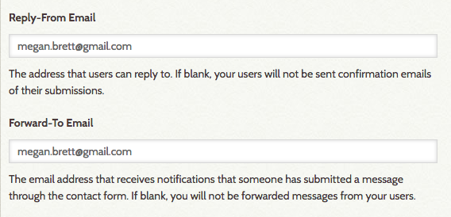
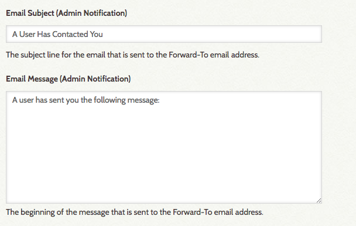
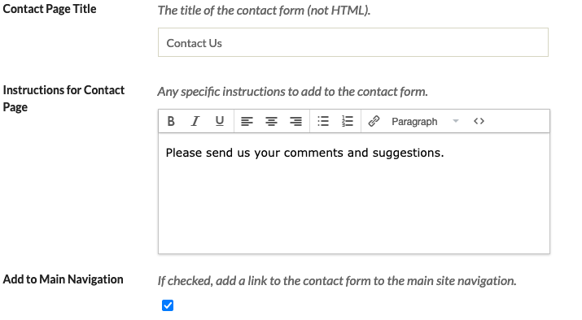
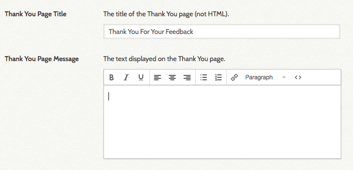

The Simple Contact Form allows you to create a contact form on your site through which visitors can send comments, suggestions, and other feedback. By default, the plugin adds "Contact Us" to your site's main navigation.

Configuration
---------------------------------------------------------------
Once you have [installed](../Admin/Adding_and_Managing_Plugins.md)
 Simple Contact, you will need to configure it. You should be automatically redirected to the plugin when you activate it from the admin Plugins page. If you are not, go to the top navigation on the admin dashboard and click Plugins, then scroll to Simple Contact (plugins are arranged alphabetically) and click the blue *Configure* button.

The configuration settings have a number of fields, almost all of which relate to setting up the various email addresses and messages needed for a contact form.

The fields are as follows:

- *Reply-From email*: if this field is filled, this is the reply-to and sent-from email address of the message sent to visitors letting them know their message has been sent (see the Public Notification options below).
- *Forward-To Email*, enter the email address to which you want notifications to go when a user submits a message via the form.  If this field is blank, you will not receive user messages sent from the contact form.

- *Email Subject (Admin Notification)*: subject line for emails sent by the system to an administrator at the *Forward-To Email* address entered above. By default, this is "A User Has Contacted  You."
- *Email Message (Admin Notification)* is the beginning of the message sent to the *Forward-to email* address; the visitor's message is added below this introduction. 

- *Email Subject (Public Notification)*: subject line for emails sent by the system to visitors who post a message through the form. 
- *Email Message (Public Notification)* is the beginning of the message sent to the visitor, and is followed by the text of the message they sent.

Configure the page on which the form appears with these settings: 

- *Contact Page Title*: the title of the page 
- *Instructions for Contact Page*: allows you to add instructions or other information to the page.
- *Add to Main Navigation*: click this checkbox to add the contact form to the main site navigation. You can manage the position of this page in the navigation [from the Appearances tab](../Admin/Appearance/Navigation.md)

When the visitor clicks the submit button on the contact page form, they are redirected to a thank you page. Settings for this are:

- *Thank You Page Title*:  title of the page.
- *Thank You Page Message*: by default this is "We appreciate your comments and suggestions."

Remember to save your changes by clicking the green Save Changes button on the right side of the window. 

You can enable [ReCaptcha](../Admin/Settings/ReCaptcha.md) on your site to reduce spammer submissions through the Contact Form.

## Public view
When a site visitor clicks the link for the contact page in the navigation, they will see a contact form with fields for Name, Email, and Message, and a recaptcha checkbox. The image here is of the contact form in the default Omeka Classic theme, Thanks Roy. 

## Receiving and replying to comment
When a site visitor submits a message via the form, it will appear in the inbox of the Forward-to email address. The message will have as sender the Name entered by the person who filled out the contact form, and will look as though it came from their email account.

To reply to the message, simply reply to the email. 