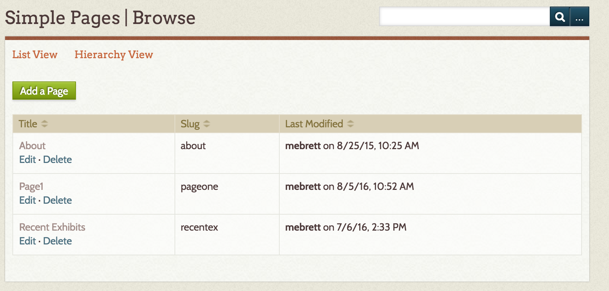
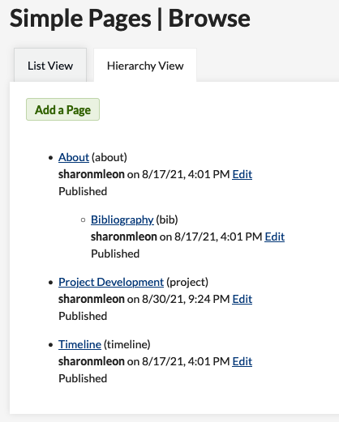
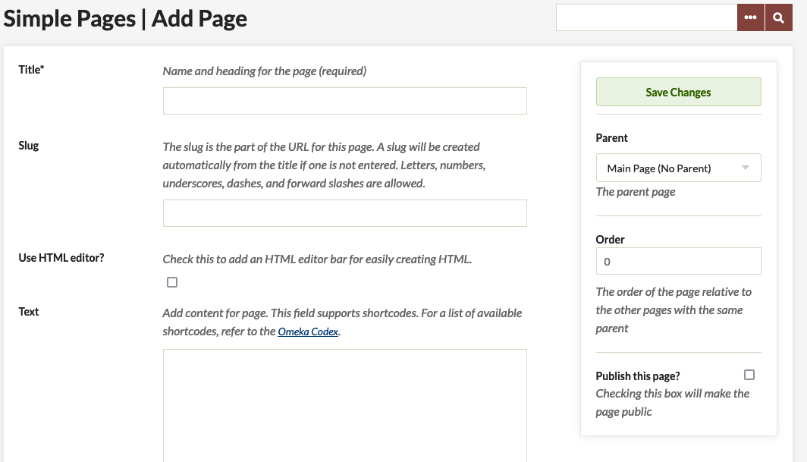

# Simple Pages

The [Simple Pages plugin](https://omeka.org/classic/plugins/SimplePages/){target=_blank} allows you to create text rich pages, for example an "About" page. It is one of the plugins that comes bundled with downloads of Omeka.

Simple Pages can be written in plain text or using HTML. You can insert items, exhibits, and files into Simple Pages by using the [Shortcodes](../Content/Shortcodes.md) available on Omeka Classic. 

## Managing Simple Pages

Add, edit, and delete Simple Pages from the tab on the left-hand navigation on the admin dashbaord.

The Simple Page admin Browse has two views: list view (default) and Hierarchy. 

The List View displays as a table with columns for the page *Title*, the page's *slug*, and the date and user that *last modified* the page.

The Hierarchy view allows you to see parent and child pages in order. When adding or editing a page, you can assign a "parent" page, one higher in the hierarchy. Each page is an unordered list item, with the page's *Title* followed by the *slug* in parentheses, the most recent date modified and by whom, and the public/private status of the page.

### Adding a Page
To add a new page, click the green *Add a Page* button on the Simple Pages admin Browse. 

On the Add Page page you can enter:

- *Title* (required): the name of the page. This is what will display by default in the [navigation](../Admin/Appearance/Navigation.md)
- *Slug*: the url for the page (youromekasite.net/slug)
- *Use HTML Editor* checkbox: tick this if you want to use the HTML editor to format the text on the page.
- *Text*: page content. 
    - If you have checked the box above, you will be able to use the [Tiny MCE HTML editor] to format this content. 
    - You can also use [shortcodes] in the text area.

To the right of these fields is the green *Save Changes* button.  Below it are the following options:

- *Parent* dropdown. Choose a parent page (above in the hierarchy) for this page.
- *Order* of this page relative to other pages with the same parent.
- *Publish this page* checkbox. Checking the box will make the page public. 

Be sure to Save Changes.

### Editing and Deleting Pages
Edit any page by going to the admin browse Simple Pages and clicking "edit" under the Page title. Note that clicking the title will take you to the public view of that page.

When you view the details of a page which has already been created, there are additional options below the *Save Changes* button. 

- Click the blue *View Public Page* button to open a new tab with the public version of the page you are editing. 
- Click the red *Delete* button to delete the page. A dialog box will pop up to ask you to confirm the deletion.

