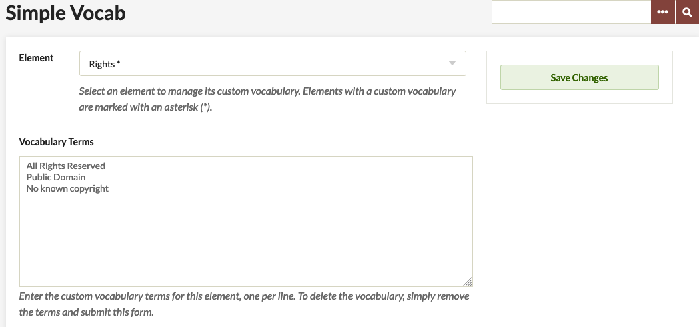
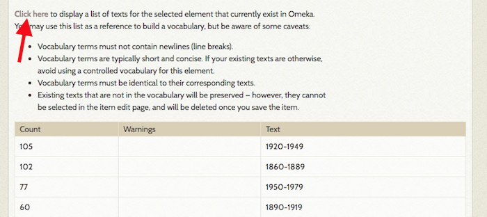
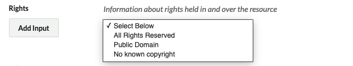

# Simple Vocab

With the [Simple Vocab plugin](https://omeka.org/classic/plugins/SimpleVocab/){target=_blank} you can define a controlled vocabulary for any metadata elements on your Omeka Classic site.

A [controlled vocabulary](https://en.wikipedia.org/wiki/Controlled_vocabulary){target=_blank} is a list of predefined terms that are predetermined by an administrator or the teach of researchers working on a project.

Using Simple Vocab, you enter the controlled vocabulary for an element as a list in the Configuration setting; when editing an item, this list appears as a drop-down menu replacing the usual text entry box for the element. From the Simple Vocab tab, you can view entered data for specific elements, in order to easily incorporate them into the list.

## Configuring the Plugin

After [installing](../Admin/Adding_and_Managing_Plugins.md) the plugin from the Plugins panel, go to the Simple Vocab tab that will appear in the left-hand menu.

- Select the Element (all Dublin Core and item type metadata fields are available) for which you wish to offer a controlled vocabulary from the dropdown list of elements
-   Enter the custom terms you want available when entering metadata for this element, one per line. 
- To save your entries, click Add/Edit Vocabulary.

To delete the vocabulary:

- Select the element (note, it should appear with starred in the drop-down list of elements), and the terms will appear in the text box below. 
- Remove all terms and re-sumbit this form by clickingAdd/Edit Vocabulary.

### Viewing Terms Already in Use
You may view a list of texts for any selected element that currently exists in your site. Simply select an element from the dropdown and click the text which says *Click here*

On click, a table will load with columns for *Count*, *Warnings*, and *Text*:

- The *Count* column displays the number of items using a particular text; 
- *Warnings* will display any possible issues translating current text to controlled vocab;

This list may be a useful reference for building controlled vocabulary, but be aware of some caveats:

-   Vocabulary terms must not contain newlines (line breaks).
-   Vocabulary terms are typically short and concise. If your existing texts are otherwise, avoid using a controlled vocabulary for this element.
-   Vocabulary terms must be identical to their corresponding texts.
-   Existing texts that are not in the vocabulary will be preserved however, they cannot be selected in the item edit page, and will be deleted once you save the item.

## Simple Vocab in Action

Once saved, the controlled vocabulary terms will appear in a drop-down menu on item pages to assist with the process of adding metadata.

