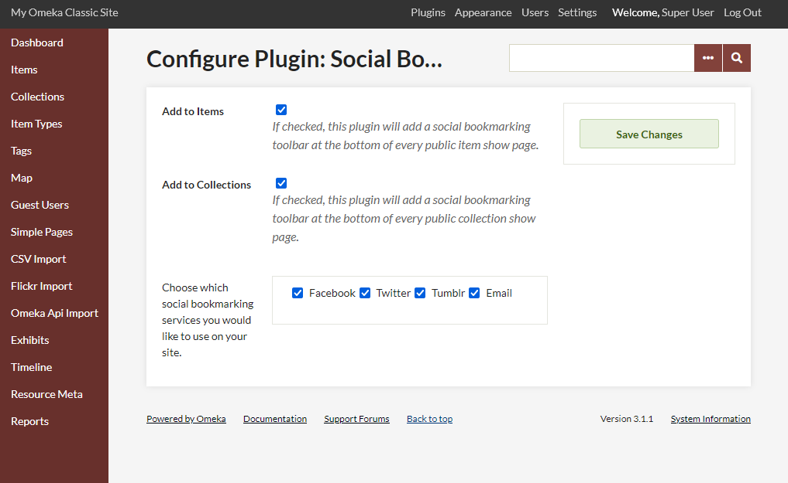
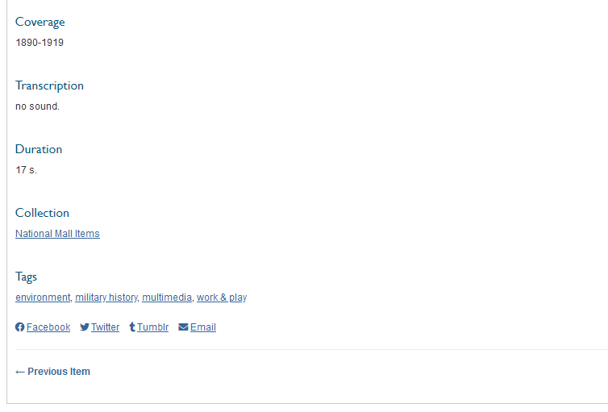

# Social Bookmarking

The [Social Bookmarking plugin](https://omeka.org/classic/plugins/SocialBookmarking/){target=_blank} inserts links to a customizable list of social networking sites below each item or collection in your Omeka Classic site. These links enable users to share your items and collections as social media posts. Currently this plugin provides buttons for Email, Facebook, Tumblr, and Twitter.

## Configuration

Once you have installed and activated the plugin, go to the Plugins page from the top navigation of the admin dashboard, scroll to Social Bookmarking, and click the green "Configure" button. 

Configuration options are: 

- **Add to Items** (checkbox): if checked, every public item/show page will have a social bookmarking toolbar at the bottom of the page, above the footer.
- **Add to Collections** (checkbox): if checked, every public collection/show page will have a social bookmarking toolbar at the bottom of the page, above the footer.
- **Choose social bookmarking services**: A series of checkboxes for various social bookmarking sites. Each icon will appear on the public items/show pages for each item, and allow site visitors to share items on their social networks, opening a new tab when clicked. All of the social networking sites come pre-selected when activating the plugin. If you do not wish to feature any of them, you must uncheck them.

On your public site, icons for the services you selected will appear at the bottom of each item or collection page.

By clicking on a service, visitors can share a link to that item or collection through their favorite social networking site.

## Integrations

Keep in mind that other plugins may add things to the items/show pages; those elements may crowd the page's public display.

## Adblockers

If a site visitor is using ad-blockers or has tracking protection turned on, the social bookmarking icons may not display.
