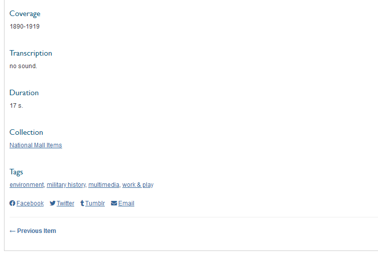

# Social Bookmarking

The [Social Bookmarking plugin](https://omeka.org/classic/plugins/SocialBookmarking/){target=_blank} inserts a customizable list of social networking sites below each item or collection in your Omeka Classic database.

## Configuration

Once you have installed and activated the plugin, go to the Plugins browse from the top navigation of the admin dashboard, scroll to Social Bookmarking, and click Configure. 

Configuration options are: 

- *Add to Items* (checkbox): if checked, every public item/show page will have a social bookmarking toolbar at the bottom of the page, above the footer.
- *Add to Collections* (checkbox): if checked, every public collection/show page will have a social bookmarking toolbar at the bottom of the page, above the footer.
- Choose social bookmarking services: A series of checkboxes for various social bookmarking sites. Each icon will appear on the public items/show pages for each item, and allow site visitors to share items on their social networks.
    -   Please note: the following social networking sites come pre-selected when activating the plugin: Delicious, Email, Facebook, Google Plus, LinkedIn, Pinterest, and Twitter. If you do not wish to feature these, you must uncheck them.

On your public site, icons for the services you selected will appear at the bottom of each item or collection page.

By clicking on an icon, visitors can share a link to that item or collection through their favorite social networking site.

## Social Bookmarking and Other Plugins

Keep in mind that if you are activating other plugins that append the items/show page for displaying content those elements may crowd the page's public display.

## Social Bookmarking and AdBlockers

If a site visitor is using ad blockers or has tracking protection turned on, the social bookmarking icons may not display.
