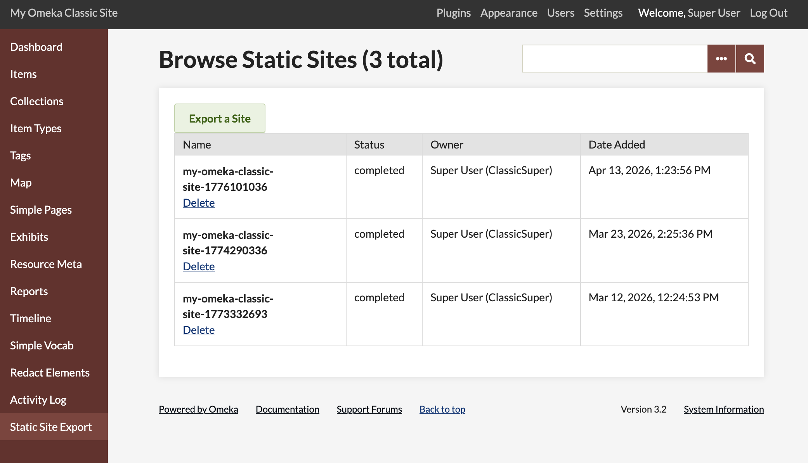
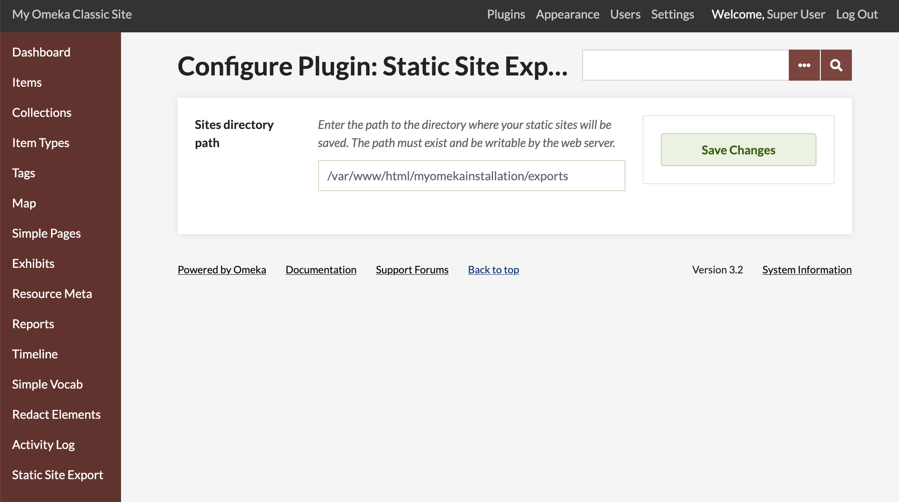
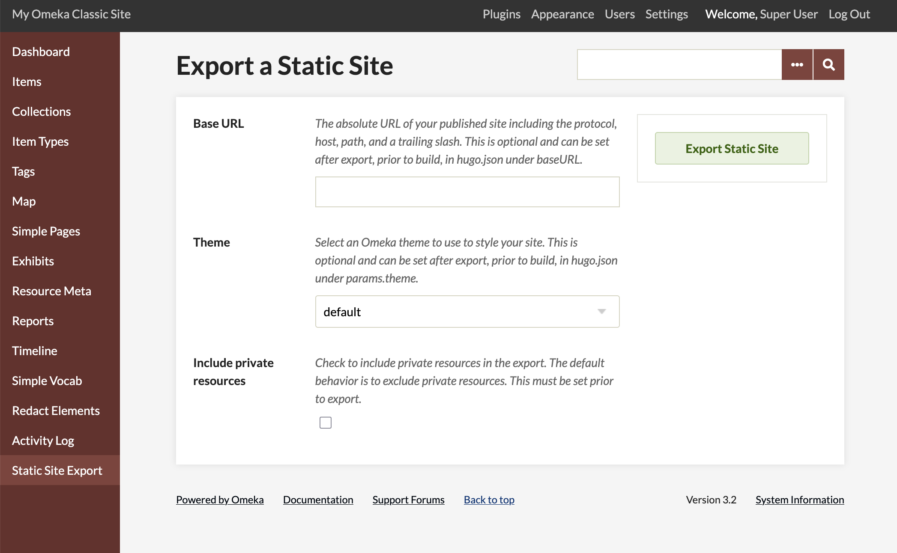
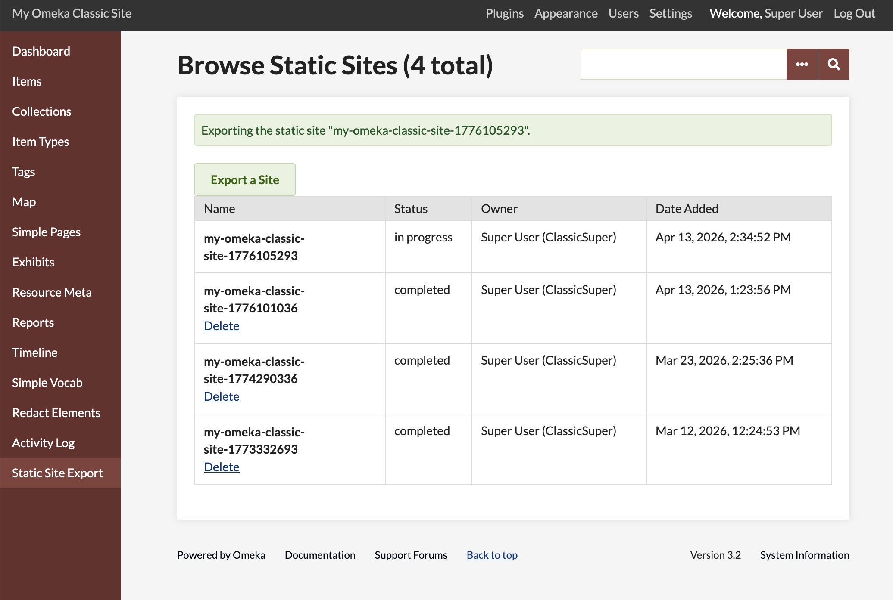
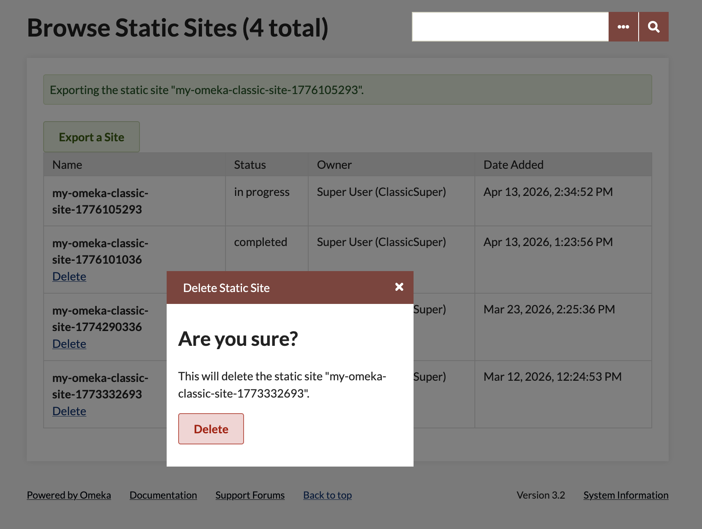

# Static Site Export

The [Static Site Export plugin](https://omeka.org/classic/plugins/StaticSiteExport/){target=_blank} 

## Configuration

## Export your site

This plugin will export your entire public site, including all exhibits. Note the difference between this and the equivalent S module, which exports individual "sites" (in S, each site can be an exhibit as well as provide browsing and searching to a selected set of resources). 

