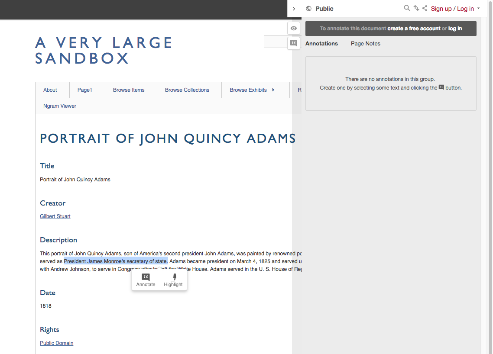

# Text Annotation

The [Text Annotation plugin](https://omeka.org/classic/plugins/TextAnnotation/){target=_blank} allows users to annotate HTML text on Omeka Classic sites using the [hypothes.is](https://hypothes.is/){target=_blank} webservice. 

## Using Text Annotation

Visitors to your site can now annotate pages by highlighting any text - including items, headers, footers, and pages - and typing into the corresponding dialog boxes. If the user does not have an account with hypothes.is, they will be prompted to create one.

Once annotations have been added, pages will display them via highlighted text which can be hovered over to reveal the notation.

For more information about how the annotations will appear, and how they function, please see the [hypothes.is](https://hypothes.is/){target=_blank} website.

## More Information

For more information on annotating in the classroom and for technical documentation, see the following readings:

- [Chauncey Monte-Sano, “Writing to Learn History: Annotating and Mini Writes,” TeachingHistory.org](http://teachinghistory.org/teaching-materials/teaching-guides/23554){target=_blank}.
- [Jeremy Dean and Katherine Schulten, “Skills and Strategies | Annotating to Engage, Analyze, Connect and Create,” New York Times, November 12, 2015, sec. The Learning Network](http://learning.blogs.nytimes.com/2015/11/12/skills-and-strategies-annotating-to-engage-analyze-connect-and-create/){target=_blank}.
- [Amanda Visconti, “Better Tech via Annotation (Using Hypothesis to Improve Your Technical Documentation, Code, and Tutorials),” Literature Geek (March 22, 2016)](http://literaturegeek.com/2016/03/22/better-tech-via-annotation-hypothesis-documentation-code-tutorials){target=_blank}.
