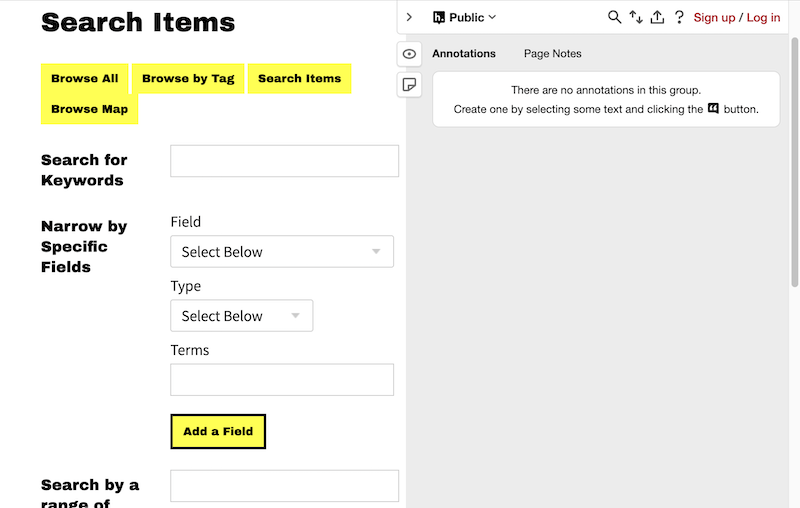
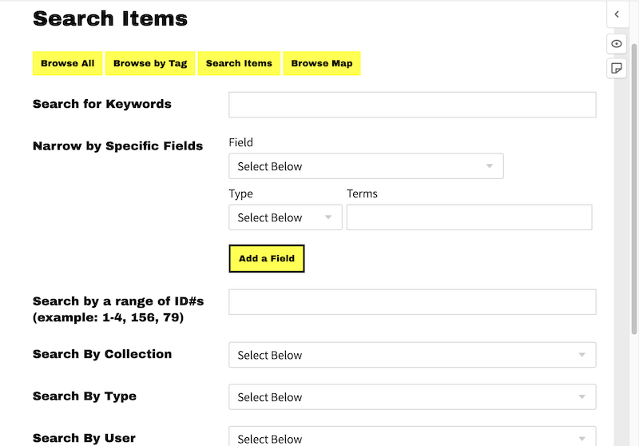
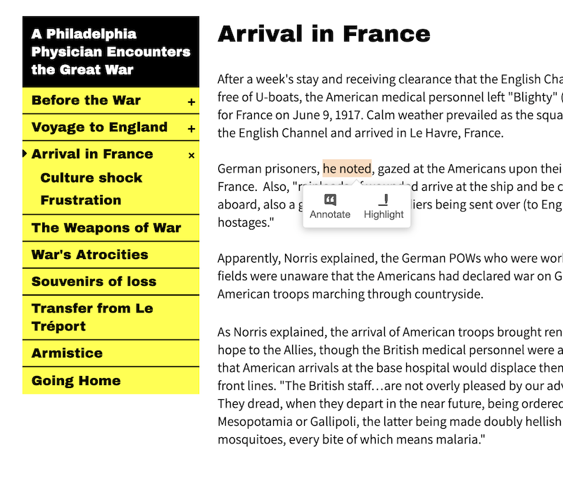

# Text Annotation

The [Text Annotation plugin](https://omeka.org/classic/plugins/TextAnnotation/){target=_blank} allows users to annotate HTML text on Omeka Classic sites using the [hypothes.is](https://hypothes.is/){target=_blank} webservice. 

## Using Text Annotation

When installed and active, the Text Annotation plugin adds a visible sidebar to the right of every page in your Classic public site. Site visitors can create or log in to hypothes.is accounts from this sidebar. The buttons are minimal by default but can be expanded by clicking on them. 

The three buttons showing when the sidebar is collapsed are:

- Annotation sidebar: Expand the sidebar showing all the existing annotations, as well as links to login or sign up for hypothes.is. 
- Show highlights: Annotated text is highlighted for discoverability by others. You can turn these highlights on or off with this button. 
- Add page note: An annotation can be added for the URL as a whole, without selecting any text. 

Visitors to your site can annotate pages by selecting any text with their cursor - including headers and footers - and choosing whether to highlight this text or leave a comment in a text box. If the user does not have an account with hypothes.is, they will be prompted to create one.

Once annotations have been added, pages will display them via highlighted text which can be hovered over to reveal the notation. Subsequent users can then respond and build comment threads on these annotations. 

For more information about how the annotations will appear, and how they function, please see the [hypothes.is](https://hypothes.is/){target=_blank} website.

Note that the sidebar will take up browser width when expanded, and will cause your site pages to shift their contents into a narrower space. Be sure your site design can accommodate this.

## Pedagogical uses

For more information on annotating in the classroom, and annotation for technical documentation, see the following readings:

- [Chauncey Monte-Sano, “Writing to Learn History: Annotating and Mini Writes,” TeachingHistory.org](http://teachinghistory.org/teaching-materials/teaching-guides/23554){target=_blank}.
- [Jeremy Dean and Katherine Schulten, “Skills and Strategies | Annotating to Engage, Analyze, Connect and Create,” New York Times, November 12, 2015, sec. The Learning Network](http://learning.blogs.nytimes.com/2015/11/12/skills-and-strategies-annotating-to-engage-analyze-connect-and-create/){target=_blank}.
- [Amanda Visconti, “Better Tech via Annotation (Using Hypothesis to Improve Your Technical Documentation, Code, and Tutorials),” Literature Geek (March 22, 2016)](http://literaturegeek.com/2016/03/22/better-tech-via-annotation-hypothesis-documentation-code-tutorials){target=_blank}.
