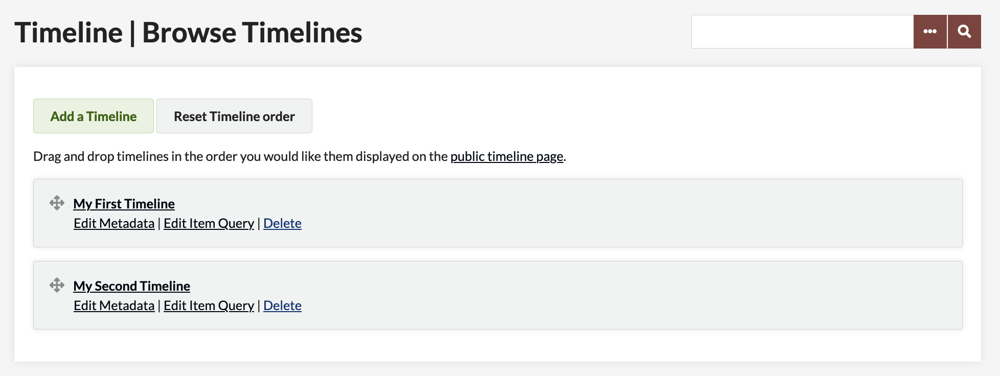

# Timeline

The [Timeline plugin](https://omeka.org/classic/plugins/Timeline/){target=_blank} allows you to add items to a timeline in your Omeka Classic site. Timeline discrete dates and intervals must be in ISO 8601 format (YYYY-MM-DDThh:mm:ss), with a / separator between dates in interval values. If date/interval values are not formatted correctly, the item will be left out of the timeline. If an item has both a discrete date value and interval value in the fields mapped by timeline metadata, the interval value will take precedence over the discrete value.

## Creating a Timeline

Once you have installed and activated the Timeline plugin, Timeline should appear in the left navigation bar. Clicking on it will take you to the Browse Timelines page.

To create a timeline, click the "Add a Timeline" link. 

On the Add a Timeline page, enter the following metadata:
- Title: the name of your timeline, which will be displayed to users
- Description: an introduction or overview for the timeline
- Item Date: a dropdown to select the metadata field to use for item date containing discrete time/date values
- Item Interval: a dropdown to select the metadata field to use for item date containing time/date span values (must be in YYYY-MM-DDThh:mm:ss/YYYY-MM-DDThh:mm:ss format)
- Item Title: a dropdown to select the metadata field to use for item titles
- Item Description: a dropdown to select the metadata field to use for item descriptions
- Status: a dropdown to select whether the timeline is public or not public
- Featured: a dropdown to select whether the timeline is featured or not featured

Once you have entered the metadata, click Save Changes to create your timeline. If your timeline was sucessfully saved, you will be returned to the Browse Timelines page and your new timeline will now be listed there. If you would like to change the metadata for your timeline, click Edit Metadata.

## Adding Items

Your timeline will appear empty until you populate it. To add items to your timeline, click Edit Item Query.

On the edit page, you can add items via the following fields:
 - Search for Keywords
 - Narrow by Specific Fields
 - Search by a range of ID#s
 - Search by Collection
 - Search by Type
 - Search by User
 - Search by Tags
 - Public/Non-Public
 - Featured/Non-Featured
 - Search by Exhibit
 - Item Relations

You can add items using one or any combination of these fields. For instance, if you know that the majority of the content for the timeline is contained in a single exibit you would want to select that exhibit in the corresponding dropdown. If you wanted to be sure you did not miss any relevant items that were not included in that exhibit, you may want to use the "Specific Fields" search to include any items mentioning the topic in their metadata that are not part of that exhibit. Or, you may want to search by a specific user if you only want to include that person's work. By adjusting the fields you can expand or narrow the scope of items included on your timeline.

Once you have filled in all the desired search fields, click Search for Items. This will add all relevant items to your timeline.

To further add or remove items from your timeline, you can adjust you query by clicking Edit Item Query. If you click delete, you will delete the entire timeline and its metadata. To see the public view of your timeline, click View Public Page.

## Displaying your Timeline

There are a couple different methods you can use to view and/or display your timeline. Timeline integrates with the [Exhibit Builder plugin](https://omeka.org/classic/docs/Plugins/ExhibitBuilder/#additional-layouts) by adding a new Timeline block option to exhibit pages: 

You can also add a timeline to a page using [Shortcodes](https://omeka.org/classic/docs/Content/Shortcodes/). 