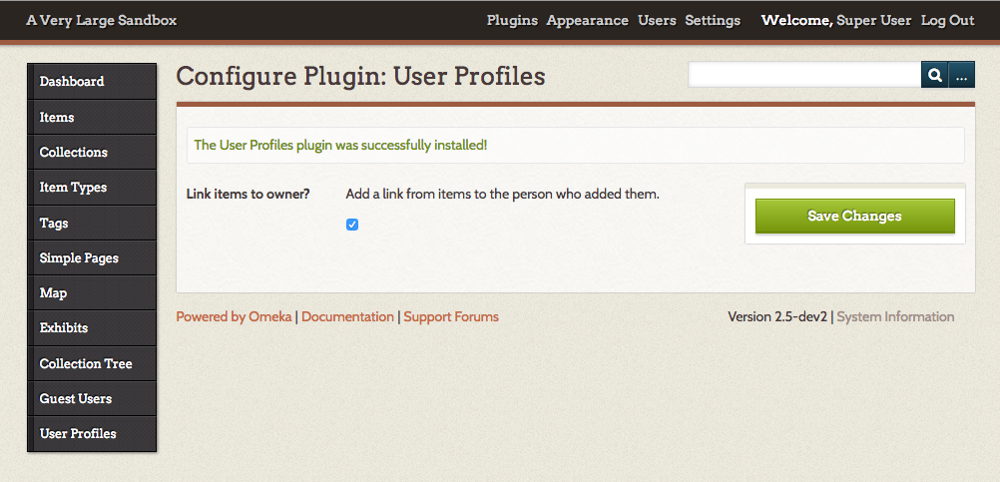
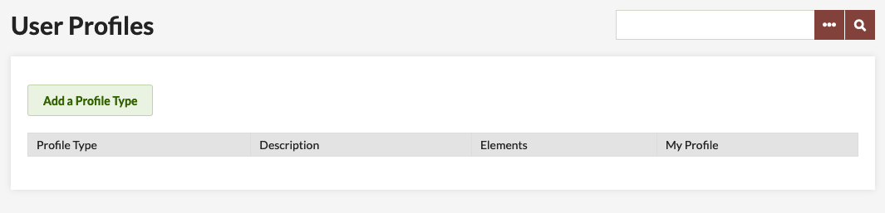
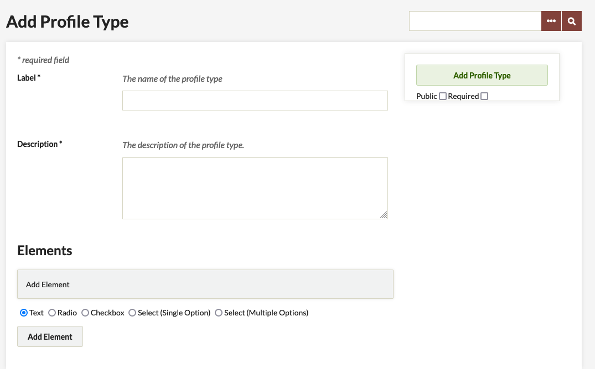
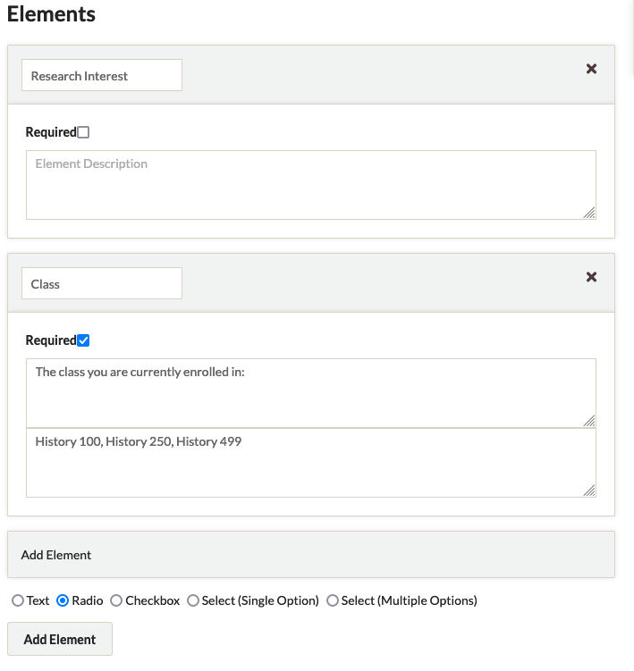
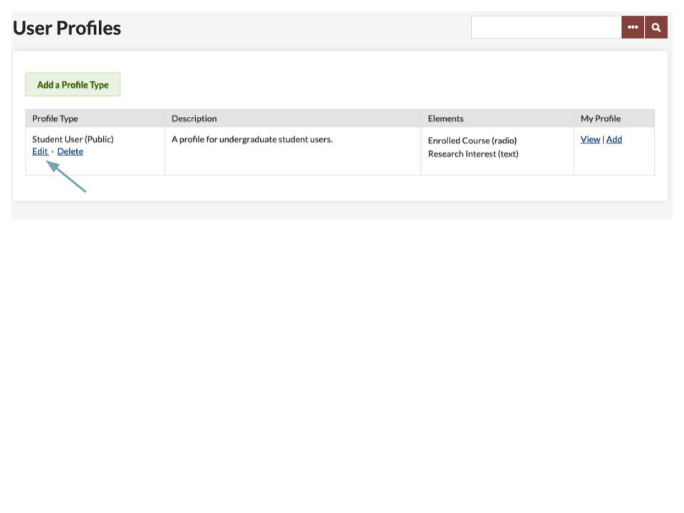
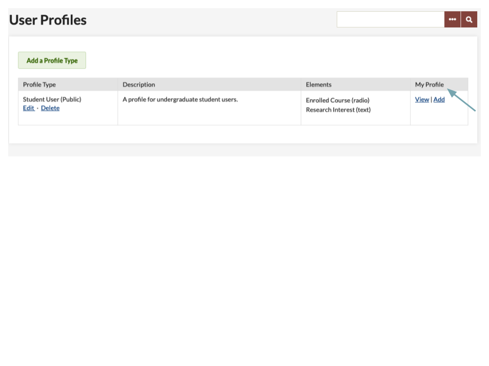

# User Profiles

The [User Profiles plugin](https://omeka.org/classic/plugins/TextAnnotation/){target=_blank} is designed to address many different situations in which gathering and/or displaying information about users is helpful on an Omeka Classic site. In many cases, these situations involve a combination of User Profiles with other plugins. Example use cases might be:

-   Create structured, consistent information about the creators of the site.
-   Give credit to researchers by having them create profiles that are automatically linked to from the items they add.
-   If commenting is used for discussion, create profiles for the moderators.
-   If the [Guest User](GuestUser.md) plugin is installed and active, guest users who comment could also create profiles.

[There is a screencast for this plugin](https://vimeo.com/165052886){target=_blank}.

## Install and Configure

User Profiles depends on the additional functionality provided by the Record Relations plugin. You will need to install Record Relations before installing User Profiles.

After you [install](../Admin/Adding_and_Managing_Plugins.md) the plugin, you will need to configure it. Initially, you will need to select whether you want Omeka to place a link from items in your archive to the person who added them. 

Then, under the User Profiles tab on the left of your screen, you may further configure your plugin.

## Manage Profile Types

To create a new profile, click the Add a Profile Type button on the User Profiles tab.

The profile type form has two required fields:

- *Label* or title.
- *Description*

If you are only creating one profile, these can be brief but if you plan to create multiple profiles you may want to make the labels distinct and the descriptions more robust. 

Profiles need at least one element. 

Every element needs an *Element Name* and a *Description* The options for Elements are:

- Text boxes
- Radio buttons
- Check boxes
- Select (single option)
- Select (multiple options)

For all elements except the Text box, enter options in a comma-separated list ("apples, oranges, pears" for example).

You can set whether a profile type is public and/or required with checkboxes just under the *Add Profile Type* button. 

If the profile is not made public, it will only be visible to users with the role super, admin, or researcher. This allows you to confidentially gather information for research. For public profiles, users may also set their own profiles to be private.

If the profile is made required, users will be notified that they need to fill out their profile when they log in.

You may edit a profile at any time by going to the User Profiles tab and clicking the Edit button under the profile type's label in the table of profile types.

To delete a profile, click the delete link under the profile type's name in the table of profile types. 

## Filling out a Profile on the Admin Side

To enter information for yourself in a user profile, go to the User Profiles tab on the left-hand navigation. Click the "Add" link for the profile you want to complete. 

## Public User Profiles

Non-admin-side Omeka users (i.e., Guest Users) who have profiles may view or edit their profiles by signing in. After sign in, they click the My Profiles link.
