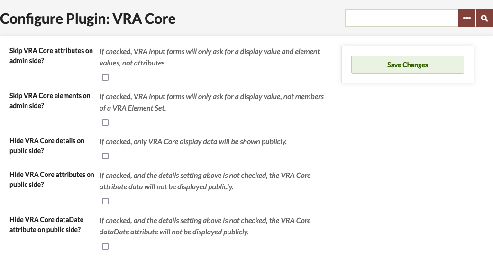
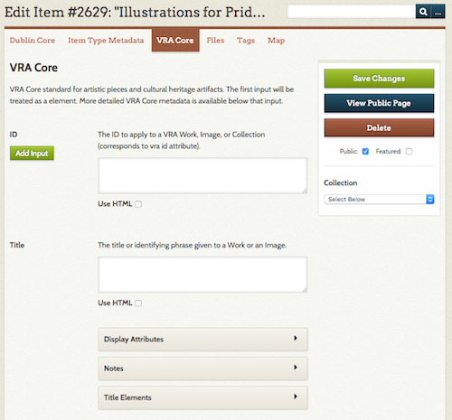
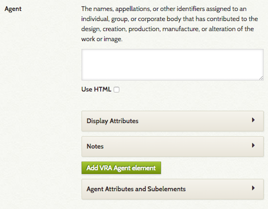

# VRA Core

The [VRA Core plugin](https://omeka.org/classic/plugins/VraCore/){target=_blank} for Omeka Classic adds elements from the [VRA Core Metadata standard](http://core.vraweb.org/index.html){target=_blank} to your Omeka site, which can be used to describe items and collections on your site. It does not replace the Dublin Core metadata elements in your Omeka Classic site.

## Configuration

Once installed, the VRA Core plugin has three configuration options, all checkboxes:

- *Skip VRA Core attributes*: when this box is checked, element attributes (extent, pref, refid, etc) are disabled on the admin side.
- *Skip VRA Core elements*: when this box is checked, users will only enter display values for items, and the elements for the value will be skipped on the admin side. For example, a user would enter title but the field for Title Elements would not be available for input.
- *Hide VRA Core details on public side*: when this box is checked, the public view of an item will only show the VRA Core display values. Additional elements and attributes will remain visible only on the admin side, if used at all.
- *Hide VRA Core attributes on public side*: when this box is checked, data entered for VRA Core attributes (extent, pref, etc) will be visible on the admin side of the Omeka installation but not on the public view.
- *Hide VRA Core dataDate attribute on public side*: when this box is checked, and the Hide VRA Core details setting above is not checked, the VRA Core dataDate attribute will not be displayed publicly.

## Adding an Item

For guidance on using the VRA Core metadata standard, please see [the VRA Core website](http://core.vraweb.org/index.html){target=_blank}.

Once the plugin is installed, VRA Core elements are available in their own tab when a user is either Adding or Editing an Item (on the same level as Item Type, File, Tags, and other metadata tabs).

Users can complete as much or as little of the VRA core as they wish. However, please note that if you do not provide a title in the Dublin Core Title element, the item will show up as `[Untitled]` throughout your site, even if the title display field in VRA Core is filled.

Each VRA Core element has a description (from the standard) and an input field. Use the checkbox below the field to use HTML formatting in this field. Below the Element input, you can add Display Element Attributes, such as extent, href, etc. For every element there is a notes field, and field options for the subelements which VRA core offers. 

The first field for each element corresponds to the `display` XML element in VRA Core. According to the VRA Core standard, there can be only one display element (this is different from the usual Dublin Core data, which can have many values.

Again, following the VRA Core standard and XML structure, many elements other than display values can have multiple values, and information corresponding to VRA Core attributes is also available. See the [Readme file](https://github.com/omeka/plugin-VraCore/blob/master/README.md){target=_blank} for more technical details.

## Uninstalling

While you can uninstall VRA Core just like any other plugin, doing so will not remove the VRA Core elements from your Omeka site. 

To remove the element set, go to Settings in the upper navigation of the admin dashboard (this area is only available to Super Users). Click on the Element Sets tab. You can then Delete the VRA Core Element Set.
