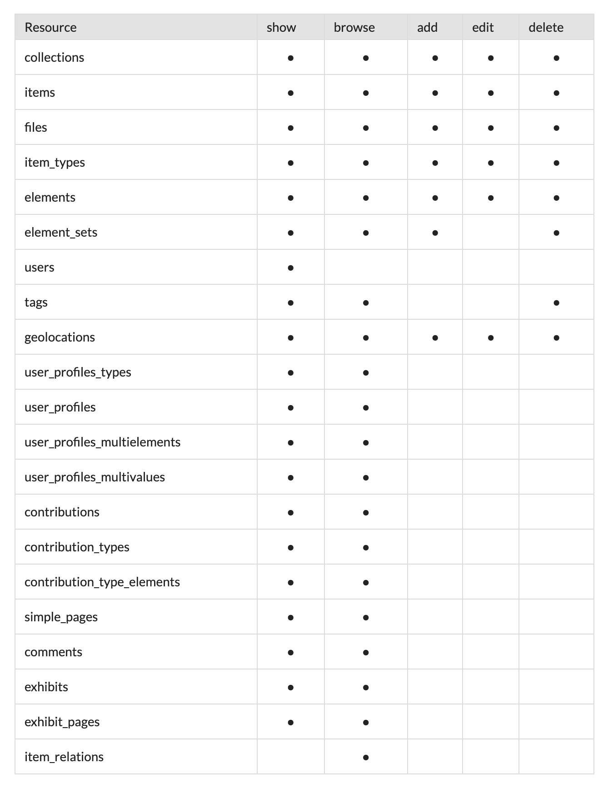

# Importing and exporting

There are several methods for importing to, or exporting from, an Omeka Classic site. Third-party plugins may add more functionality; we are only documenting Omeka-team-supported methods here. 

## Connect to another Omeka site

You cannot currently export from an Omeka S installation to a Classic site. 

### Import from Classic to Classic

You can use the [Omeka API Import plugin](../Plugins/Omeka_API_Import.md) to import items & collections from a Classic site. This plugin imports material accessible from the [API](../Admin/Settings/API_Settings.md): items and their metadata (including tags), attached files, collections, users, comments and contributions, Simple Pages, and Exhibit Builder content. 

If equivalent plugins are installed on both the source site and the target site, Omeka API Import can import plugin-specific metadata. For example, geolocation data facilitated by the Geolocation plugin will automatically be imported; [PDF Text](https://omeka.org/classic/plugins/PdfText/){target=_blank} elements can be imported.

The plugin offers all possible data accessible by the API (see the next section). An API key is required to access private installation data, such as users and their profiles, and private items and collections. 

The instructions on [how to move your Omeka Classic site from one server to another](Moving_to_Another_Server.md) may be of use. 

### Access data using the API

You can use your own Classic site's API to crawl data as required, or export a spreadsheet for one-time use. You can [request different formats through the API](https://omeka.org/s/docs/developer/api/rest_api/#responses){target=_blank}, including `jsonld` and `rdfxml`. 

[For more information on the API, see the developer documentation section.](https://omeka.org/s/docs/developer/api/){target=_blank}.

The API can share information about the following resource types:

- Collections
- Element Sets
- Elements
- Files
- Item Types
- Items
- Resources
- Site
- Tags
- Users.

There are example scripts for using the API to output information [in the developer documentation](https://omeka.readthedocs.io/en/latest/Reference/api/examples.html){target=_blank}.

#### Copy over settings

You cannot directly import all installation settings and theme configuration. We recommend that after an import is performed, you compare both installations side-by-side to confirm that all settings match. 

#### Import or export vocabularies

You cannot export or import [Simple Vocab](plugins/SimpleVocab.md) vocabularies at this time. 

#### Import or export plugin data

The [API](../Admin/Settings/API_Settings.md) offers data from the following (Omeka-team-authored) plugins: Simple Pages, Exhibits, Contribution, Geolocation, Comments, Item Relations, User Profiles. 

Note that this does not include Timelines, Collection Tree, Simple Vocab, the CSS Editor, Posters, and Reports, among others. The easiest way to confirm what can be exported is to go to your source installation and view the "API" tab in the Settings. Any content displayed in that table can be exported assuming the target installation has the same plugins installed. Any content not displayed there cannot be accessed. 

## Connect to non-Omeka platforms

### Omeka Classic connectors

Omeka Classic has plugins for connecting to:

- Zotero
- Scripto (for MediaWiki content).

### Import from a spreadsheet

Omeka S can take data in any spreadsheet (tabular) form, whether a CSV, an Excel file, or an ODS. Use the [CSV Import plugin](../Plugins/CSVImport.md) to add items and media to your Omeka Classic site from a spreadsheet. This includes data exported from many different databases and platforms. Export the data from your source platform into a spreadsheet. This may require some modification or cleanup of the data before importing into Omeka Classic. 

You cannot create collections en masse using CSV Import.  

## Back up your Omeka Classic site

### Back up your database

See the instructions on [backing up your database on this page](Backing_up_an_Omeka_Database.md).

### Output item information

Every Omeka Classic browse page, search result page, and item view page has links to output the data contained in the results set: see [this page about Output Formats](Output_Formats.md) for more information on how these formats can be used to export your collections. 