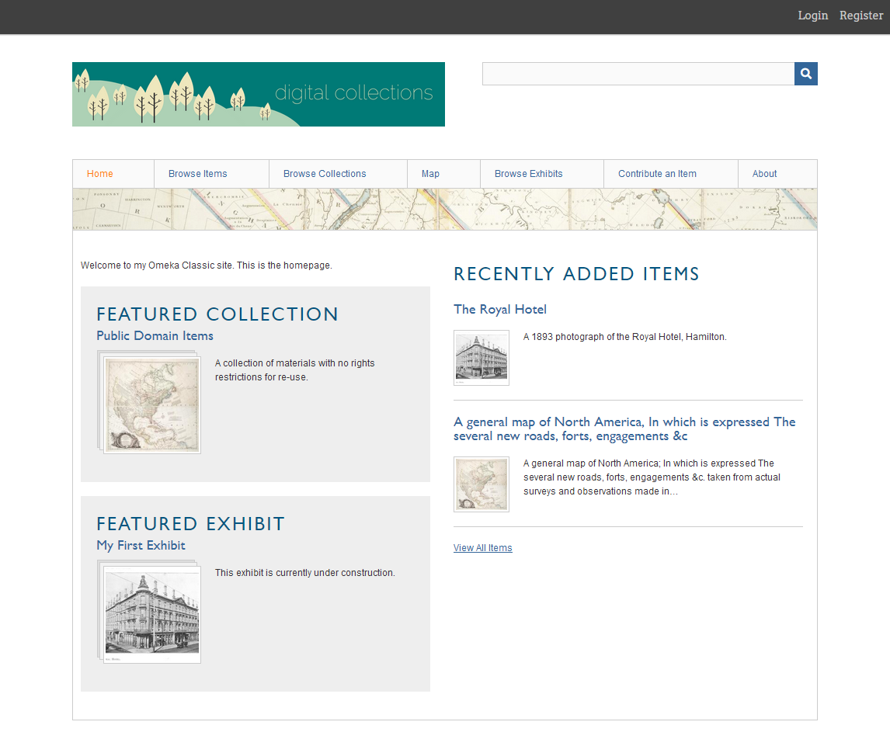

# Berlin 

The Berlin theme: 

- Uses a dark blue theme colour on white and grey backgrounds, with an orange link highlight. 
- Constrains your webpages to 960px in width. This can be overridden using custom CSS to change the `header` width, `content` div width, `primary-nav` div width, and `footer` width. 
- Displays the site title or logo at the top left of the screen and a search bar on the right.
- Displays website pages in a row of rectangular tabs across the top of the main content area. 
- Provides a text area to provide footer content.
- Will display your logo image at 480px maximum width, and constrain the height proportionally. A banner-shaped logo is recommended, at 480px wide and 100px tall. 
- Will display a header image at a maximum width of 960px.

!!! note
	Even if a theme does not offer an customization option on its Configuration page, you can still modify how your website looks and behaves using the [CSS Editor plugin](../Plugins/CSS_Editor.md). This can include text, header, link, and background colors, the widths and heights of elements, borders around elements and images, the size of text, and the ways that logos and header images display.

## Theme settings

Header and Footer
Logo File

Choose a logo file. This will replace the site title in the header of the theme. Recommended maximum width for the logo is 500px.
Header Image

Choose an image file to display below your header. Recommended max height is 100px.
Alt Text for Header Image

Provide descriptive text of the header image for screen readers.
Footer Text

Add some text to be displayed in your theme's footer.
Display Copyright in Footer

Check this box if you wish to display your site's copyright information in the footer.
Use Advanced Site-wide Search

Check this box if you wish to allow users to search your whole site by record (i.e. item, collection, file) and choose their boolean method.
Homepage
Display Featured Item

Check this box if you wish to show the featured item on the homepage.
Display Featured Collection

Check this box if you wish to show the featured collection on the homepage.
Display Featured Exhibit

Check this box if you wish to show the featured exhibit on the homepage.
Homepage Recent Items

Choose a number of recent items to be displayed on the homepage.
Homepage Text

Add some text to be displayed on your homepage.
Items
Item File Display

Check this box if you wish to display your item files in fullsize at the top of the item page.

## Admin info

Abstraction of the Making the History of 1989 theme for Omeka Classic.

Berlin is Copyright © 2018-present Corporation for Digital Scholarship, Vienna, Virginia, USA http://digitalscholar.org

The Corporation for Digital Scholarship distributes the Omeka source code under the GNU General Public License, version 3 (GPLv3). See the LICENSE file for the full text.

The Omeka name is a registered trademark of the Corporation for Digital Scholarship.

Third-party copyright in this distribution is noted where applicable.

All rights not expressly granted are reserved.