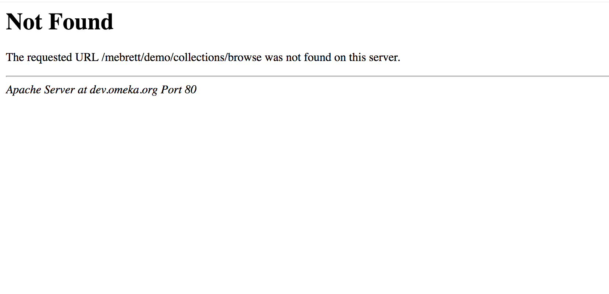
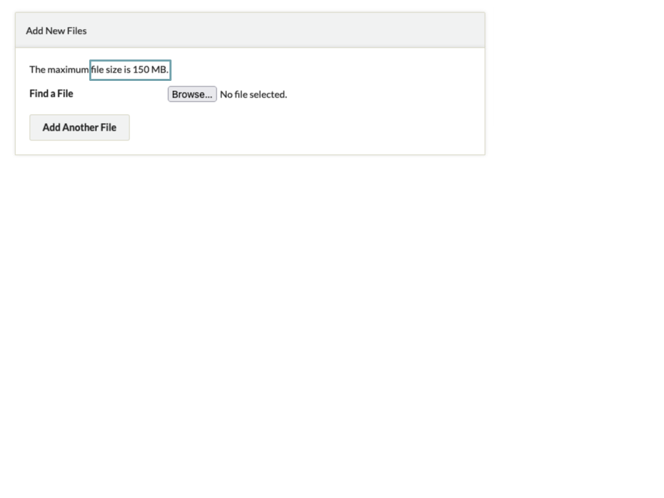

# Troubleshooting 

These are some of the most common issues that administrators encounter when setting up or working with their Omeka sites. If you do not see your issue here, please post a description of your issue along with the version of Omeka and any plugins involved on the [Omeka Forums](https://forum.omeka.org){target=_blank}.

## 404 and Not Found

If you follow a link in Omeka Classic and you get a 404 error, page not found, or an error saying the URL is not valid, this is likely caused by a `mod_rewrite` problem on your server. 

There are two possibilities:

1.  You forgot to copy the `.htaccess` file when FTPing your install. Double check that it transferred properly.
2.  Your server may not have `mod_rewrite` installed. 

If installing `mod_rewrite` does not solve the problem, check that your Apache configuration allows `.htaccess` overrides. You will need the `AllowOverride All` directive in the appropriate place in `httpd.conf`.

## File Upload Errors

If you are receiving errors related to file size uploads, you will need to look at your PHP settings and possibly contact your server administrator.

1. The upload.maxFileSize limit in Omeka’s `application/config/config.ini` is only useful for decreasing the limit, not for increasing it. It is there to restrict uploads in Omeka more narrowly than your PHP settings already mandate. It is not set by default and plays no role in increasing the upload maximum size.
2. The php.ini setting `upload_max_filesize` is a limit set by PHP that constrains the maximum size of any one file. If this is smaller than a file you want to upload, you need to increase it.
3. The php.ini setting `post_max_size` is a limit set by PHP that constrains the maximum total amount of data that can be sent in any one request. This includes uploaded files as well as any regular form data (the contents of text inputs and textareas, for example). This setting must be at least as large as `upload_max_filesize` for that setting to have any effect, and generally should be larger, to allow for some data to be sent alongside a large file and/or to allow multiple large files to be uploaded at once.

Omeka Classic will read all three of these settings and display the largest file upload size in the "Add New Files" block on the the Files tab when adding or editing an item.

Of these three, it’s most often `post_max_size` that’s the problem, as PHP has some odd behaviors when you exceed that limit which can make the cause of the error a little less obvious. The others tend to give you fairly clear error messages.

## Getting Better Error Messages

A blank or white screen is often an indication that Omeka or PHP has encountered an error. Since error messages can often contain private or technical information, Omeka hides them by default. See [Retrieving Error Messages](Retrieving_Error_Messages.md) for instructions on how to show these messages. The content of error messages can be extremely useful for troubleshooting, so try these steps before seeking further help.

## Further Help Troubleshooting

If you continue to have problems, please post a description of your issue along with the version of Omeka and any plugins involved on the [Omeka Forums](https://forum.omeka.org){target=_blank}.
